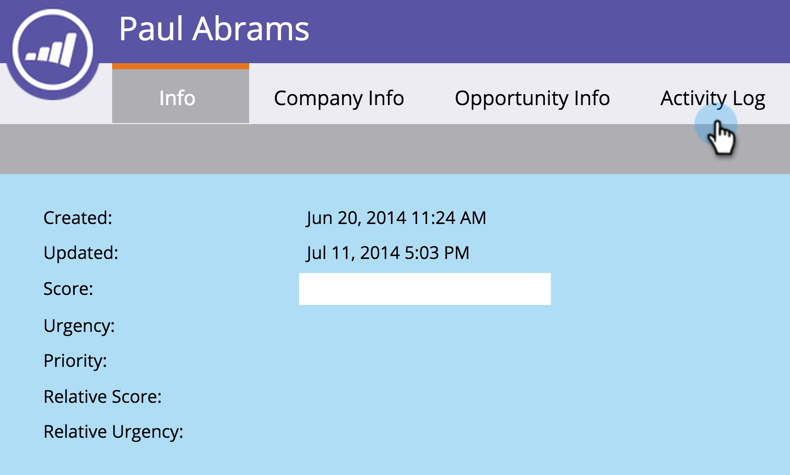

# Filtrer les types d’activité dans le journal d’activité d’une personne {#filter-activity-types-in-the-activity-log-of-a-person}

Recherchez les activités qui vous intéressent le plus dans le journal des activités.

>[!NOTE]
>
>En savoir plus sur [le journal d’activité](/help/marketo/product-docs/core-marketo-concepts/smart-lists-and-static-lists/managing-people-in-smart-lists/locate-the-activity-log-for-a-person.md){target="_blank"}.

1. Accédez à la page Détails de la personne . Cliquez sur l’onglet **[!UICONTROL Journal d’activité]**.

   

1. Sélectionnez la liste déroulante **[!UICONTROL Filtre]**.

   

## Création de filtres personnalisés {#creating-custom-filters}

1. Cliquez sur le menu déroulant **[!UICONTROL Filtre]**. Sélectionnez **[!UICONTROL Personnalisé]**.

   

1. Sélectionnez les activités par lesquelles effectuer le filtrage. Cliquez sur **[!UICONTROL Enregistrer sous]**.

   

1. Saisissez un **[!UICONTROL nom de filtre personnalisé]**. Cliquez sur **[!UICONTROL Enregistrer]**

   

   Désormais, seules les activités de personne répondant aux critères du filtre s’affichent.

   

## Référencer les filtres enregistrés {#reference-saved-filters}

Les filtres enregistrés sont accessibles à partir de la liste déroulante [!UICONTROL Filtre].

1. Cliquez sur la liste déroulante **[!UICONTROL Filtres]**. Sélectionnez **[!UICONTROL Personnalisé]**.

   

1. Cliquez sur **[!UICONTROL Filtres enregistrés]**. Les filtres enregistrés sont répertoriés ci-dessous.

   
