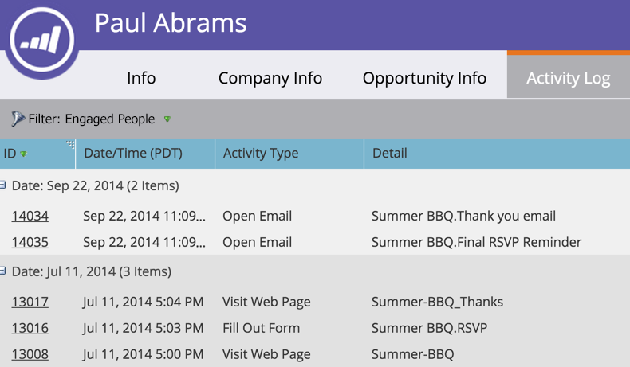

# Filtrer les types d&#39;Activité dans le journal des Activités d&#39;une personne {#filter-activity-types-in-the-activity-log-of-a-person}

Recherchez les activités qui vous importent le plus dans le journal des activités.

>[!NOTE]
>
>**Plongée profonde**
>
>En savoir plus sur [le journal des activités](locate-the-activity-log-for-a-person.md).

1. Accédez à la page **Détails sur la personne**. Cliquez sur l&#39;onglet **Journal des Activités**.

   

1. Sélectionnez la liste déroulante **Filtre**.

   

## Création de Filtres personnalisés {#creating-custom-filters}

1. Cliquez sur la liste déroulante **Filtre**. Sélectionnez **Personnalisé**.

   

1. Sélectionnez les activités par lesquelles filtrer. Cliquez sur **Enregistrer sous**.

   

1. Entrez un **nom de filtre personnalisé**. Cliquez sur **Enregistrer**.

   

   Désormais, seules les activités de personnes qui répondent aux critères du filtre sont affichées.

   

## Filtres enregistrés de référence {#reference-saved-filters}

Les filtres enregistrés sont accessibles à partir de la liste déroulante **Filtre**.

1. Cliquez sur la liste déroulante **Filtres**. Sélectionnez **Personnalisé**.

   

1. Cliquez sur **Filtres enregistrés**. Les filtres enregistrés sont répertoriés ci-dessous.

   

