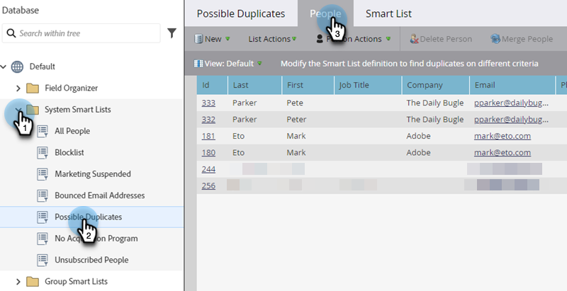

# Rechercher et fusionner les personnes en double {#find-and-merge-duplicate-people}

Marketo Engage déduplique automatiquement les nouvelles personnes qui entrent dans le système. Cependant, votre CRM a peut-être initialement envoyé des doublons. Voici comment les fusionner.

>[!CAUTION]
>
>La fusion des personnes est permanente, il n’y a pas d’option « annuler ».

>[!PREREQUISITES]
>
>La recherche et la fusion des doublons impliquent l’utilisation de [listes dynamiques intégrées/système](/help/marketo/product-docs/core-marketo-concepts/smart-lists-and-static-lists/using-smart-lists/use-built-in-system-smart-lists.md){target="_blank"}.

>[!NOTE]
>
>Marketo ne déduplique pas automatiquement les données par rapport à une synchronisation [!DNL Salesforce] ou [!DNL Microsoft Dynamics], ou lorsque vous saisissez manuellement des personnes.

## Rechercher doublons {#find-duplicates}

1. Accédez à la zone **[!UICONTROL Base de données]**.

   

   >[!CAUTION]
   >
   >La fusion de personnes dans Marketo peut ne pas fonctionner si vous utilisez un compte de personne [!DNL Salesforce]. Si possible, fusionnez les enregistrements dans [!DNL Salesforce].

1. Sélectionnez la liste dynamique système **[!UICONTROL Doublons possibles]** puis cliquez sur l’onglet **[!UICONTROL Personnes]**.

   

   >[!NOTE]
   >
   >Vous pouvez également [Rechercher des personnes en double avec la logique personnalisée](/help/marketo/product-docs/core-marketo-concepts/smart-lists-and-static-lists/managing-people-in-smart-lists/find-duplicate-people-with-custom-logic.md){target="_blank"}.

## Fusionner les personnes manuellement {#merge-people-manually}

>[!CAUTION]
>
>Lors de la fusion de personnes, si la personne perdante possède un objet personnalisé Marketo, celui-ci ne sera _pas_ associé à nouveau à la personne gagnante. Veuillez réinitialiser l&#39;objet personnalisé avant d&#39;effectuer la fusion.

1. Sélectionnez les doublons en maintenant la touche Ctrl/Cmd enfoncée et en cliquant sur **[!UICONTROL Fusionner les personnes]**.

   

   >[!TIP]
   >
   >Vous pouvez avoir deux doublons ou plus pour la même personne. Sélectionnez-les tous en même temps.

1. Les valeurs entre les enregistrements qui ne correspondent pas s’affichent. _Sélectionnez la valeur que vous souhaitez conserver pour chaque champ_. Cliquez sur **[!UICONTROL Fusionner]** lorsque vous avez terminé. Si vous ne souhaitez aucune de ces valeurs, cochez la case **[!UICONTROL Personnalisé]** et saisissez la valeur de votre choix.

   

   >[!NOTE]
   >
   >* Contrairement à Salesforce, lors de la fusion de personnes dans Marketo, leurs scores ne sont _pas additionnés_ Vous sélectionnez les valeurs que vous souhaitez conserver.
   >
   >* Lors de la fusion manuelle des personnes, la première personne sélectionnée sera la « gagnante ». Ainsi, dans l’onglet Personnes, si vous fusionnez les ID d’enregistrement 198 et 199 et que vous cliquez d’abord sur 199, 199 sera l’ID d’enregistrement des personnes fusionnées. Cela s’applique également si plus de deux enregistrements sont fusionnés.

   >[!TIP]
   >
   >Une fusion est préférable à une suppression. Vous conserverez tous les historiques (visites de pages, clics sur les liens, ouvertures d’e-mails, remplissages de formulaires, etc.).

## Effet dans Salesforce {#effect-in-salesforce}

Si vous disposez d’une intégration Salesforce, voici quelques remarques sur l’effet de la fusion des prospects dans Salesforce.

* Lors de la fusion de leads ou de contacts uniquement, ils fusionnent selon les règles de [!DNL Salesforce] normales.
* Lors de la fusion de leads et de contacts, tous les leads sont convertis en contacts avant la fusion selon les règles de [!DNL Salesforce] normales.

Pour plus d’informations sur le comportement de Salesforce lors de la fusion de prospects ou de contacts, consultez les documents [!DNL Salesforce] suivants :

* [Fusion des prospects en double](https://help.salesforce.com/HTViewHelpDoc?id=leads_merge.htm&language=en_US){target="_blank"}
* [Fusion des contacts en double](https://help.salesforce.com/HTViewHelpDoc?id=contacts_merge.htm&language=en_US){target="_blank"}

## Fusion en bloc {#bulk-merging}

Si vous avez trop de doublons à fusionner manuellement, contactez l’équipe du compte Adobe (votre gestionnaire de compte) pour discuter de vos options.
