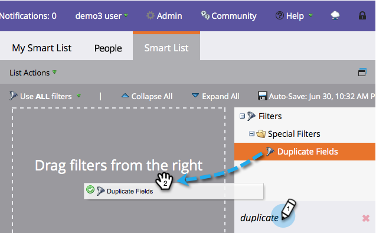
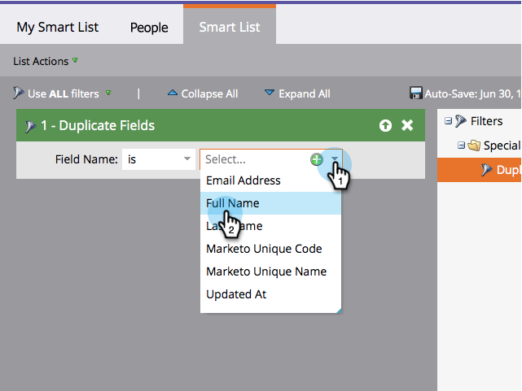

# Rechercher les personnes en double à l’aide d’une logique personnalisée {#find-duplicate-people-with-custom-logic}

Marketo Engage dispose d’une liste dynamique système qui détecte les doublons en faisant correspondre leurs adresses e-mail. Si vous souhaitez utiliser un autre champ pour rechercher des doublons, procédez comme suit.

>[!PREREQUISITES]
>
>[Créer une liste dynamique](/help/marketo/product-docs/core-marketo-concepts/smart-lists-and-static-lists/creating-a-smart-list/create-a-smart-list.md){target="_blank"}

1. Accédez à la zone **[!UICONTROL Activités marketing]**.

1. Sélectionnez votre liste dynamique, puis cliquez sur l’onglet **[!UICONTROL Liste dynamique]**.

   

1. Recherchez et faites glisser le filtre **[!UICONTROL Champs en double]** sur la zone de travail.

   

1. Choisissez l’une des quatre options disponibles :

   * [!UICONTROL Adresse électronique]
   * [!UICONTROL Nom complet]
   * [!UICONTROL Nom]
   * [!UICONTROL Mise À Jour Le]

   >[!NOTE]
   >
   >Tous les champs, à l’exception de Adresse e-mail, sont sensibles à la casse. Ainsi, l’utilisation de « john doe » dans le champ Nom complet _renvoie pas_ résultats pour John Doe.

   

   Terminé ! Exécutez la liste dynamique pour rechercher des personnes ayant la même valeur dans le champ précédemment sélectionné.
