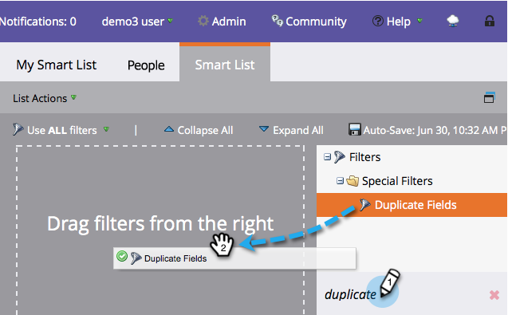

# Recherche de personnes en double avec une logique personnalisée {#find-duplicate-people-with-custom-logic}

Marketo Engage dispose d’une liste dynamique système qui détecte les personnes en double en correspondant à leurs adresses électroniques. Si vous souhaitez utiliser un autre champ pour rechercher des doublons avec, voici comment.

>[!PREREQUISITES]
>
>[Création d’une liste dynamique](/help/marketo/product-docs/core-marketo-concepts/smart-lists-and-static-lists/creating-a-smart-list/create-a-smart-list.md){target="_blank"}

1. Accédez au **[!UICONTROL Activités marketing]** zone.

1. Sélectionnez votre liste dynamique, puis cliquez sur **[!UICONTROL Liste dynamique]** .

   

1. Recherchez et faites glisser le **[!UICONTROL Dupliquer les champs]** filtre sur la zone de travail.

   

1. Sélectionnez l’une des quatre options disponibles :

   * Adresse e-mail
   * Nom complet
   * Nom
   * Mis à jour à

   >[!NOTE]
   >
   >Tous les champs, à l’exception de l’adresse électronique, sont sensibles à la casse. Ainsi, l’utilisation de &quot;john doe&quot; dans le champ Nom complet _not_ renvoie les résultats pour John Doe.

   

   Fait! Exécutez la liste dynamique pour rechercher les personnes ayant la même valeur dans le champ précédemment sélectionné.
