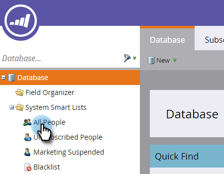

# Recherchez le journal des Activités d&#39;une personne {#locate-the-activity-log-for-a-person}.

Le journal des activités est la source ultime de vérité. Voici l&#39;histoire complète du parcours d&#39;une personne sur le marché du travail.

1. Accédez à la **base de données**.

   

1. Sélectionnez **Toutes les personnes**.

   

1. Cliquez sur l&#39;onglet **Personnes**. Sélectionnez une personne **Id** numéro.

   

1. Cliquez sur **Journal des Activités**.

   

   Voici. Le journal des activités ! Il s&#39;agit d&#39;une collection de toutes les informations qui se produisent au fil du temps pour une personne.

   

   >[!MORELIKETHIS]
   >
   >Pour en savoir plus sur le [filtrage du journal des activités](/help/marketo/product-docs/core-marketo-concepts/smart-lists-and-static-lists/managing-people-in-smart-lists/filter-activity-types-in-the-activity-log-of-a-person.md)afin d’afficher des activités de personnes spécifiques.
