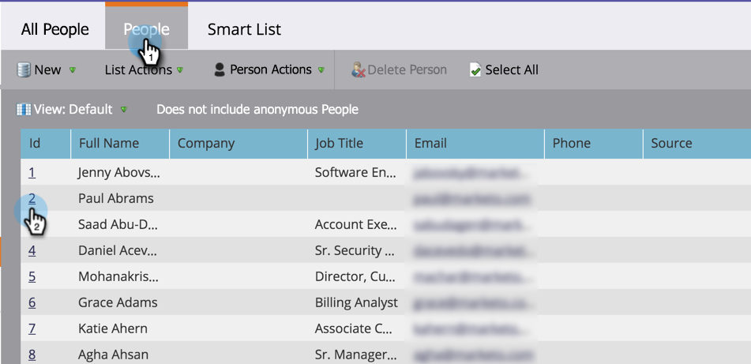

# Recherche du journal d’activité d’une personne {#locate-the-activity-log-for-a-person}

Le journal d’activité est la source ultime de vérité. C&#39;est l&#39;histoire complète du parcours d&#39;une personne dans Marketo.

1. Accédez à la **Base de données**.

   

1. Sélectionnez **Toutes les personnes**.

   

1. Cliquez sur l’onglet **Personnes** . Sélectionnez un numéro **Id** de personne.

   

1. Cliquez sur **Journal d’activité**.

   

   Vous disposez désormais d’une collection de toutes les informations qui se produisent au fil du temps pour une personne.

   

## Exporter le journal d’activité {#export-activity-log}

Vous devez exporter le journal des activités d’une personne vers Excel ?

1. Après avoir suivi les étapes ci-dessus, faites défiler la page vers le bas et sélectionnez l’icône Exporter .

   

1. Un fichier Excel est téléchargé vers votre navigateur.

   

   >[!MORELIKETHIS]
   >
   >En savoir plus sur le [filtrage du journal d’activités](/help/marketo/product-docs/core-marketo-concepts/smart-lists-and-static-lists/managing-people-in-smart-lists/filter-activity-types-in-the-activity-log-of-a-person.md) pour afficher des activités de personnes spécifiques.
