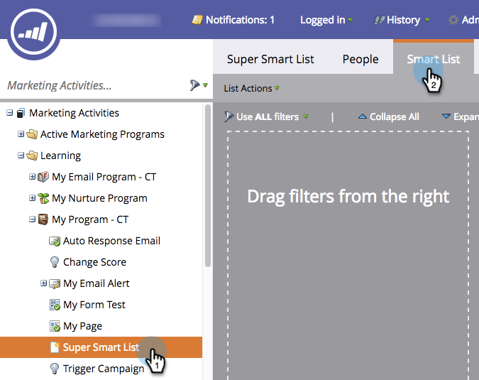
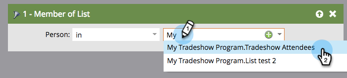

# Utiliser les personnes membres d’une liste dans une liste intelligente {#use-members-of-list-in-a-smart-list}

>[!TIP]
>
>Vous pouvez ajouter des personnes à une liste à l’aide du flux [Importer](/help/marketo/getting-started/quick-wins/import-a-list-of-people.md) ou [Ajouter à la liste](/help/marketo/product-docs/core-marketo-concepts/smart-campaigns/flow-actions/add-to-list.md){target="_blank"}.

Avec ce filtre, vous pouvez extraire des membres d’une autre liste en y faisant référence dans vos règles de liste dynamique. Voici comment faire.

1. Sélectionnez une liste dynamique et cliquez sur l’onglet **[!UICONTROL Liste dynamique]**.

   

1. Dans le panneau Filtres du côté droit, recherchez et faites glisser le filtre **[!UICONTROL Membre de la liste]** sur la zone de travail.

   

1. Cliquez sur la liste déroulante ou saisissez pour rechercher la liste à inclure dans votre liste dynamique.

   

   Terminé ! Dans cet exemple, la liste dynamique cible désormais uniquement les membres de cette liste et les évalue en fonction des autres règles que vous incluez.
