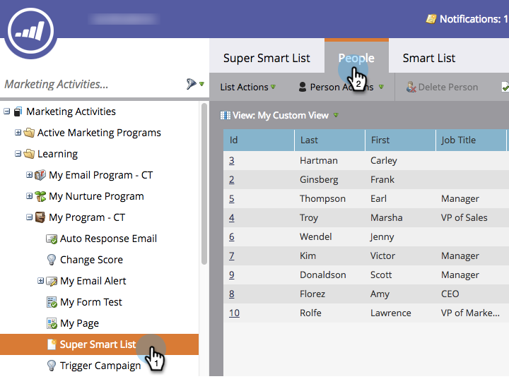

# Utilisation de la fonction Recherche rapide dans une liste ou une liste dynamique {#use-quick-find-in-a-list-or-smart-list}

Recherchez une personne dans les résultats d’une liste ou d’une liste dynamique à l’aide de la recherche rapide.

1. Accédez à **[!UICONTROL Activités marketing]**.

   

1. Sélectionnez la liste dynamique à rechercher, puis cliquez sur l’onglet **[!UICONTROL Personnes]** .

   

## Recherche de personnes à l’aide d’informations personnelles {#find-people-using-personal-info}

1. Dans la zone **[!UICONTROL Recherche rapide]** située en bas de l’écran, saisissez un mot-clé (**nom personnel**, **adresse électronique** ou **titre de la tâche**).

   

1. Appuyez sur Entrée ou cliquez sur l’icône de recherche pour terminer.

## Recherche de personnes à l’aide d’un nom d’entreprise {#find-people-using-a-company-name}

1. Pour rechercher une société, saisissez `[company]` dans la zone Recherche rapide, suivie d’une partie du nom de la société que vous recherchez.

   

1. Appuyez sur Entrée ou cliquez sur l’icône de recherche pour terminer.
