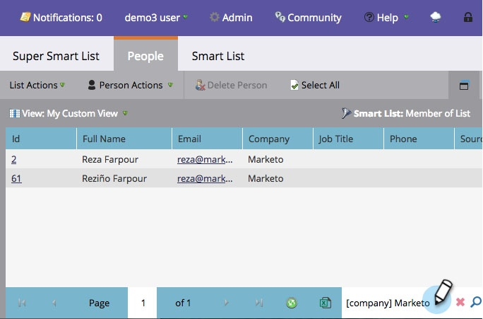

# Utilisation de la fonction Recherche rapide dans une Liste ou une Liste dynamique {#use-quick-find-in-a-list-or-smart-list}

Trouvez une personne à partir des résultats d&#39;une liste ou d&#39;une liste intelligente en utilisant la recherche rapide.

1. Accédez à **Activités marketing**.

   

1. Sélectionnez la liste intelligente à rechercher, puis cliquez sur l’onglet **Personnes**.

   

## Rechercher des personnes utilisant des informations personnelles {#find-people-using-personal-info}

1. Dans la zone **Recherche rapide** située au bas de l’écran, tapez un mot clé (**nom personnel**, **adresse électronique** ou **titre du travail**).

   

1. Appuyez sur Entrée ou cliquez sur l&#39;icône de recherche et vous avez terminé !

## Rechercher des personnes utilisant un nom de Société {#find-people-using-a-company-name}

1. Pour trouver une société, tapez [**société**] dans la zone **Recherche rapide**, suivie d&#39;une partie du nom de la société que vous recherchez.

   

1. Appuyez sur Entrée ou cliquez sur l&#39;icône de recherche et vous avez terminé !

Félicitations — travail rapide !
