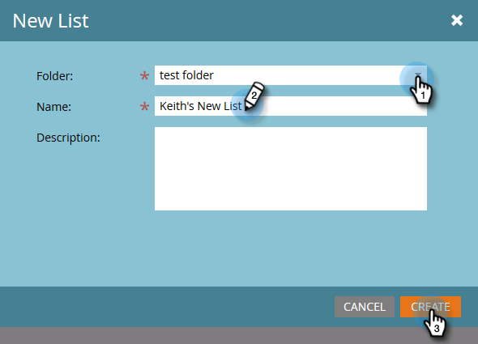

# Créer une liste statique {#create-a-static-list}

Les listes statiques sont un groupe de personnes déjà présentes dans votre base de données. Voici comment en créer un.

1. Accédez à **[!UICONTROL Base de données]**.

   

1. Cliquez sur la liste déroulante **[!UICONTROL Nouveau]** et sélectionnez **[!UICONTROL Nouvelle liste]**.

   

1. Choisissez un dossier de destination, donnez un nom à votre nouvelle liste, puis cliquez sur **[!UICONTROL Créer]**.

   

   Vous disposez désormais d’une liste vide prête à être remplie. Découvrez comment ajouter des personnes [ici](/help/marketo/product-docs/core-marketo-concepts/smart-lists-and-static-lists/static-lists/understanding-static-lists.md#ways-to-add-remove-people-from-a-list){target="_blank"}.

   >[!NOTE]
   >
   >Vous pouvez ajouter une personne à votre liste autant de fois que vous le souhaitez, mais elle n’apparaîtra qu’une seule fois. Les personnes restent dans la liste jusqu’à ce que vous les supprimiez.
