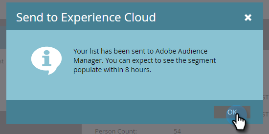

# Exportation d’une Liste statique vers Adobe Experience Cloud {#export-a-static-list-to-adobe-experience-cloud}

>[!NOTE]
>
>Un déploiement prêt pour la HIPAA d’une instance de Marketo ne peut pas utiliser cette fonctionnalité.

>[!NOTE]
>
>**Conditions préalables**
>
>[Configuration du partage des Audiences Adobe Experience Cloud](http://docs.marketo.com/x/D4GMAg)

## Applications de destination prises en charge {#supported-destination-applications}

* Adobe Advertising Cloud
* Adobe Analytics (**uniquement** si vous possédez une licence Adobe Audience Manager)
* Adobe Audience Manager
* Adobe Experience Manager
* Plate-forme de données client en temps réel Adobe
* Adobe Target

## Exportation d’une Liste {#how-to-export-a-list}

1. Dans Marketo, recherchez et sélectionnez la liste à exporter.

   

1. Cliquez sur la liste déroulante Actions **de** Liste et sélectionnez **Envoyer à l’Experience Cloud**.

   

1. Cliquez sur la liste déroulante Dossier **** d’Audience Manager et sélectionnez le dossier de destination de votre choix dans l’Experience Cloud.

   

1. Choisissez de créer une audience ou de remplacer une autre (dans cet exemple, nous en créons une nouvelle). Saisissez le nouveau nom de l’audience et cliquez sur **Envoyer**.

   

1. Cliquez sur **OK**.

   

   >[!NOTE]
   >
   >Il peut falloir jusqu&#39;à 6-8 heures pour que l&#39;audience puisse être pleinement inscrite à l&#39;Adobe.

## Éléments à noter {#things-to-note}

**Partage en Adobe Analytics**

Pour les clients qui possèdent à la fois Adobe Audience Manager et Adobe Analytics, cette intégration permet aux audiences d’être partagées de Marketo vers vos suites de rapports Adobe Analytics. Toutefois, d’autres étapes de configuration doivent être effectuées dans Adobe Audience Manager pour activer cette fonctionnalité. Veuillez consulter la documentation de Adobe Audience Manager pour plus d’informations sur la façon de configurer ceci : [https://docs.adobe.com/content/help/en/analytics/integration/audience-analytics/mc-audiences-aam.html](http://docs.adobe.com/content/help/en/analytics/integration/audience-analytics/mc-audiences-aam.html).

**Utilisation des caractéristiques pour les clients Adobe Audience Manager**

Lorsque vous lancez une exportation de liste dans Marketo, vous constaterez les modifications suivantes reflétées dans votre instance Adobe Audience Manager :

* Pour toutes les pistes de la Liste exportée, Marketo écrira une caractéristique en utilisant les courriers électroniques hachés des pistes comme identifiant multipériphériques. Le nom de la caractéristique correspondra au nom de l’Audience de destination que vous avez spécifié lors de l’exportation.
* Pour tous les ECID que Marketo a réussi à faire correspondre aux pistes de la Liste exportée, Marketo écrira une caractéristique à l&#39;aide de l&#39;identifiant de périphérique ECID. Le nom de la caractéristique correspondra au nom de l’Audience de destination que vous avez spécifié lors de l’exportation.
* Marketo crée également un segment dans votre instance d’Audience Manager en utilisant la caractéristique ECID comme seul critère de segmentation. Le nom du segment correspondra au nom de l’Audience de destination que vous avez spécifié lors de l’exportation.

## FAQ {#faq}

**Pourquoi la taille de la liste dans Marketo est-elle différente de celle de l’Adobe ?**

Sous le capot, l’intégration des audiences fonctionne en synchronisant les cookies Marketo Munchkin avec le cookie ECID d’Adobe correspondant. Marketo ne peut partager que les données d&#39;adhésion pour les pistes pour lesquelles Marketo a synchronisé un ECID. Pour un résultat optimal, il est recommandé de charger le script de suivi munchkin.js de Marketo en parallèle avec le code de suivi visiteur.js de l’Adobe sur toutes les pages que vous souhaitez suivre à des fins marketing.

**Comment fonctionne la synchronisation des cookies ?**

Lorsque la synchronisation des cookies est activée pour votre Abonnement Marketo, le fichier munchkin.js de Marketo tente de capturer et de stocker les ECID d’Adobe pour l’organisation IMS d’Adobe que vous avez spécifiée lors de la configuration de l’intégration et de faire correspondre ces ECID à l’identifiant de cookie Marketo correspondant. Cela permet aux profils utilisateurs anonymes de Marketo de s’enrichir avec des ECID d’Adobe.

Une autre étape est nécessaire pour associer le profil d’utilisateur anonyme à un Profil de piste, qui est identifié à l’aide d’un courrier électronique en texte brut. Voici la description exacte de ce fonctionnement : [https://docs.marketo.com/display/public/DOCS/Tracking+Anonymous+Activity+and+People](http://docs.marketo.com/display/public/DOCS/Tracking+Anonymous+Activity+and+People).
