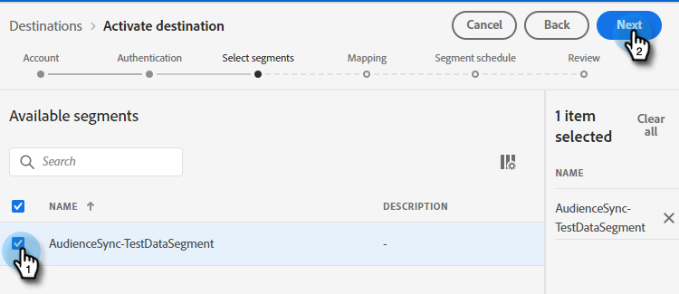
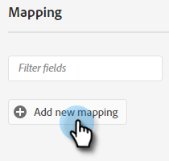
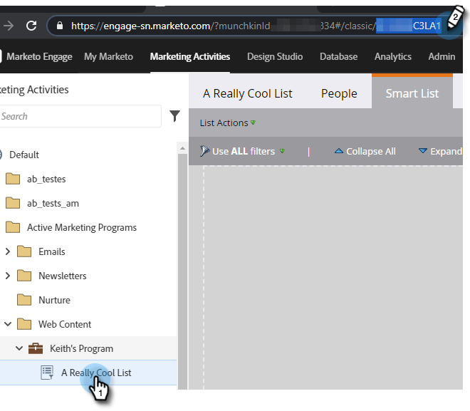

# Envoi d’un segment Adobe Experience Cloud vers une liste statique Marketo {#push-an-adobe-experience-cloud-segment-to-a-marketo-static-list}

Cette fonctionnalité vous permet de transférer les segments situés dans votre Adobe Experience Platform vers Marketo sous la forme d’une liste statique.

>[!PREREQUISITES]
>
>* [Créez un ](/help/marketo/product-docs/administration/users-and-roles/create-an-api-only-user.md) utilisateur d’API dans Marketo.
>* Ensuite, accédez à **Admin** > **Point de lancement**. Recherchez le nom du rôle que vous venez de créer, puis cliquez sur **Afficher les détails**. Copiez et enregistrez les informations dans **ID client** et **Secret client**, car vous en aurez besoin pour cette fonctionnalité.

1. Connectez-vous à [Adobe Experience Platform](https://experience.adobe.com/).

   

1. Cliquez sur l’icône de grille et sélectionnez **Experience Platform**.

   

1. Dans le volet de navigation de gauche, cliquez sur **Destinations**.

   

1. Cliquez sur **Catalogue**.

   

1. Recherchez la mosaïque du Marketo Engage et cliquez sur **Activer**.

   

1. Sous Type de compte, cliquez sur le bouton radio **Nouveau compte** . Saisissez vos informations d’identification Marketo et cliquez sur **Se connecter à la destination**.

   

   >[!NOTE]
   >
   >Vous pouvez trouver votre Munchkin ID en accédant à **Admin** > **Munchkin** (il fait également partie de votre URL Marketo une fois connecté). Identifiant du client/secret que vous devez posséder en suivant les conditions préalables dans la partie supérieure de cet article.

1. &quot;Connecté&quot; doit apparaître sous vos informations d’identification. Cliquez sur **Suivant** dans le coin supérieur droit.

   

1. Saisissez un **Nom** et une _description_ facultative. Cliquez sur **Créer la destination**.

   >[!NOTE]
   >
   >Le choix d’un élément dans les actions marketing est également facultatif. Marketo n’exploite pas ces informations pour l’instant, mais le fera probablement bientôt.

   

1. Cliquez sur **Suivant**.

   

1. Choisissez le segment souhaité, puis cliquez sur **Suivant**.

   

   >[!NOTE]
   >
   >Les segments vers les listes statiques sont 1:1. Si vous choisissez ici plusieurs segments, vous devrez associer chaque segment à une liste statique spécifiée dans l’onglet Planification de segments .

1. Cliquez sur **Ajouter un nouveau mappage**.

   

1. Cliquez sur l’icône du curseur.

   

1. Sélectionnez le bouton radio **Sélectionner les attributs** ou **Sélectionner un espace de noms d’identité** (dans cet exemple, nous choisissons des attributs).

   

   >[!NOTE]
   >
   >Si vous choisissez **Sélectionner un espace de noms d’identité**, passez à l’étape 15 après avoir effectué votre sélection.

1. Sélectionnez le champ approprié qui contient l’adresse électronique qui identifie l’utilisateur. Cliquez sur **Sélectionner** lorsque vous avez terminé.

   

   

   >[!NOTE]
   >
   >L’exemple que nous avons choisi peut sembler bien différent de votre sélection.

1. Cliquez sur l’icône de mappage.

   

1. Sélectionnez votre champ cible et cliquez sur **Sélectionner**.

   

1. Cliquez sur **Suivant**.

   

1. _Dans Marketo_, créez une liste statique ou recherchez et sélectionnez-en une que vous avez déjà créée. Copiez l’ID de mappage à partir de la fin de l’URL.

   

   >[!NOTE]
   >
   >Pour de meilleurs résultats, assurez-vous que la liste que vous référencez dans Marketo est vide.

1. De retour dans Adobe Experience Platform, saisissez l’identifiant que vous venez de copier. Sélectionnez votre Date de début. Les utilisateurs se synchronisent en permanence jusqu’à la date de fin choisie. Pour une synchronisation indéfinie, laissez la date de fin vide. Cliquez sur **Suivant** lorsque vous avez terminé.

   

1. Confirmez vos modifications et cliquez sur **Terminer**.

   
