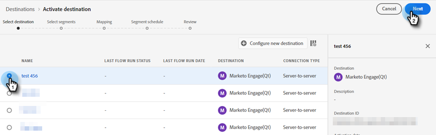
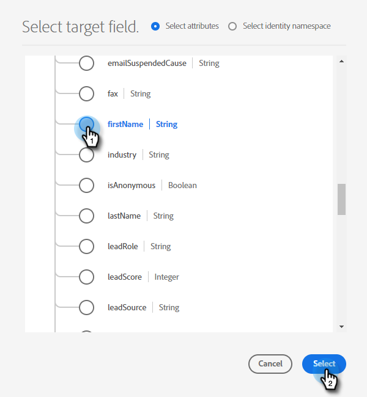
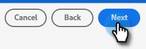
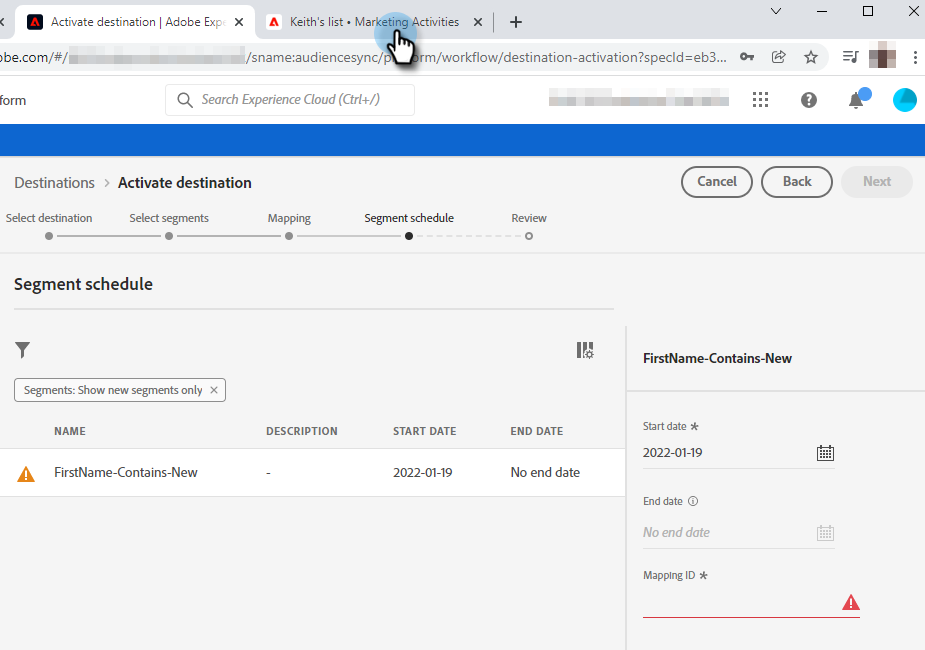

# Intégrer un segment Adobe Experience Platform à une liste statique Marketo {#push-an-adobe-experience-platform-segment-to-a-marketo-static-list}

Cette fonctionnalité vous permet d’envoyer les segments situés dans votre Adobe Experience Platform vers Marketo Engage sous la forme d’une liste statique.

>[!PREREQUISITES]
>
>* [Modifiez le rôle d’API](/help/marketo/product-docs/administration/users-and-roles/create-delete-edit-and-change-a-user-role.md#edit-an-existing-role){target="_blank"} pour vous assurer qu’il dispose de l’autorisation **Personne en lecture-écriture** (qui se trouve sous la liste déroulante API Access).
>* [Création d’un utilisateur d’API](/help/marketo/product-docs/administration/users-and-roles/create-an-api-only-user.md){target="_blank"} dans Marketo.
>* Accédez à **[!UICONTROL Admin]** > **[!UICONTROL Launchpoint]**. Recherchez le nom du rôle que vous venez de créer et cliquez sur **[!UICONTROL Afficher les détails]**. Copiez et enregistrez les informations dans **[!UICONTROL ID client]** et **[!UICONTROL Secret client]**, car vous pourriez en avoir besoin pour l’étape 7.
>* Dans Marketo, créez une liste statique, ou recherchez et sélectionnez-en une que vous avez déjà créée. Vous aurez besoin de son identifiant.

1. Connectez-vous à [Adobe Experience Platform](https://experience.adobe.com/){target="_blank"}.

   

1. Cliquez sur l’icône de grille et sélectionnez **[!UICONTROL Experience Platform]**.

   

1. Dans le volet de navigation de gauche, cliquez sur **[!UICONTROL Destinations]**.

   

1. Cliquez sur **[!UICONTROL Catalogue]**.

   

1. Recherchez la mosaïque Marketo Engage et cliquez sur **[!UICONTROL Activer]**.

   

1. Cliquez sur **[!UICONTROL Configurer une nouvelle destination]**.

   

1. Sous Type de compte, sélectionnez le bouton radio Compte existant ou Nouveau compte (dans cet exemple, nous choisissons **[!UICONTROL Compte existant]**). Cliquez sur l’icône Sélectionner un compte .

   

   >[!NOTE]
   >
   >Si vous choisissez Nouveau compte, vous pouvez rechercher votre Munchkin ID en accédant à **[!UICONTROL Admin]** > **[!UICONTROL Munchkin]** (il fait également partie de votre URL Marketo une fois connecté). L’ID client/le secret doit être défini à partir des conditions préalables mentionnées en haut de cet article.

1. Choisissez le compte de destination et cliquez sur **[!UICONTROL Sélectionner]**.

   

1. Saisissez un **[!UICONTROL Nom]** de destination et une description facultative. Cliquez sur le menu déroulant Création de personne et sélectionnez « Faire correspondre les personnes Marketo existantes et Créer les personnes manquantes dans Marketo » _ou_ « Faire correspondre les personnes Marketo existantes uniquement » (dans cet exemple, nous choisissons la première). Vous devez également choisir un **[!UICONTROL Workspace]**.

   

   >[!NOTE]
   >
   >Si vous choisissez « [!UICONTROL Correspondre uniquement aux personnes Marketo existantes] », il vous suffira de mapper l’e-mail et/ou l’ECID, de sorte que vous pouvez ignorer les étapes 13 à 16.

1. Cette section est facultative. Cliquez sur **[!UICONTROL Créer]** pour l’ignorer.

   

1. Sélectionnez la destination créée et cliquez sur **[!UICONTROL Suivant]**.

   

1. Sélectionnez le segment à envoyer à Marketo et cliquez sur **[!UICONTROL Suivant]**.

   

   >[!NOTE]
   >
   >Si vous choisissez plusieurs segments, vous devez mapper chaque segment à une liste statique spécifiée dans l’onglet [!UICONTROL Planification des segments].

   >[!IMPORTANT]
   >
   >Après la première activation d’un segment vers la destination Marketo, le remplissage des profils qui existaient déjà dans le segment avant l’activation de la destination Marketo peut prendre jusqu’_à 24 heures_. À l’avenir, chaque fois que des profils seront ajoutés au segment, ils seront immédiatement ajoutés à Marketo.

1. Cliquez sur **[!UICONTROL Ajouter un nouveau mappage]**.

   

1. Cliquez sur l’icône de mappage.

   

1. Sélectionnez le ou les attributs souhaités, puis cliquez sur **[!UICONTROL Sélectionner]**. Dans cet exemple, nous choisissons le prénom, le nom et l’adresse e-mail.

   

   >[!NOTE]
   >
   >Vous pouvez mapper des attributs d’Experience Platform à l’un des attributs auxquels votre organisation a accès dans Marketo Engage. Utilisez la [requête d’API Describe](https://experienceleague.adobe.com/en/docs/marketo-developer/marketo/rest/lead-database/lead-database#describe){target="_blank"} pour récupérer les champs d’attribut auxquels votre organisation a accès.

1. Mappez le nom et le nom de la société en cliquant de nouveau sur **[!UICONTROL Ajouter un nouveau mappage]** et en répétant deux fois l’étape 15, en choisissant **[!UICONTROL nom]** puis **[!UICONTROL nomSociété]**.

   

1. Il est maintenant temps de mapper l’adresse e-mail. Cliquez de nouveau sur **[!UICONTROL Ajouter un nouveau mappage]**.

   

1. Cliquez sur l’icône de mappage.

   

1. Cliquez sur le bouton radio Sélectionner un espace de noms d’identité, choisissez **[!UICONTROL E-mail]**, puis cliquez sur **[!UICONTROL Sélectionner]**.

   

   >[!IMPORTANT]
   >
   >Le mappage de l’e-mail et/ou de l’ECID depuis l’onglet **[!UICONTROL Espace de noms d’identité]** est la chose la plus importante à faire pour vous assurer que la personne est mise en correspondance dans Marketo. L’e-mail de mappage garantira le taux de correspondance le plus élevé.

1. Il est maintenant temps de choisir les champs sources. Pour l&#39;e-mail, cliquez sur l&#39;icône du curseur.

   

1. Cliquez sur le bouton radio Sélectionner un espace de noms d’identité, recherchez et sélectionnez **[!UICONTROL E-mail]**, puis cliquez sur **[!UICONTROL Sélectionner]**.

   

1. Pour sélectionner le champ source Nom de la société , cliquez sur l’icône de curseur dans sa ligne.

   

1. Laissez le bouton radio Sélectionner des attributs coché. Recherchez « company » et sélectionnez **[!UICONTROL companyName]**, puis cliquez sur **[!UICONTROL Select]**.

   

1. Mappez les champs sources pour le nom et le prénom en cliquant sur l’icône du curseur pour chacun d’eux et en répétant deux fois l’étape 23, en choisissant **[!UICONTROL nom]** puis **[!UICONTROL prénom]**.

   

1. Cliquez sur **[!UICONTROL Suivant]**.

   

1. Vérifiez vos modifications et cliquez sur **[!UICONTROL Terminer]**.

   
