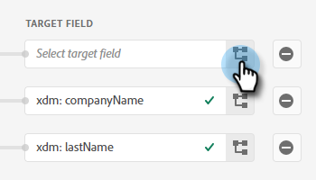

# Envoi d’un segment Adobe Experience Platform vers une liste statique Marketo {#push-an-adobe-experience-platform-segment-to-a-marketo-static-list}

Cette fonctionnalité vous permet de transférer les segments situés dans votre Adobe Experience Platform vers Marketo Engage sous la forme d’une liste statique.

>[!PREREQUISITES]
>
>* [Modification du rôle de l’API](/help/marketo/product-docs/administration/users-and-roles/create-delete-edit-and-change-a-user-role.md#edit-an-existing-role){target="_blank"} pour s’assurer qu’il a la variable **Personne en lecture-écriture** autorisation (disponible dans la liste déroulante API d’accès).
>* [Création d’un utilisateur API](/help/marketo/product-docs/administration/users-and-roles/create-an-api-only-user.md){target="_blank"} dans Marketo.
>* Accédez à **[!UICONTROL Administration]** > **[!UICONTROL Launchpoint]**. Recherchez le nom du rôle que vous venez de créer, puis cliquez sur **[!UICONTROL Afficher les détails]**. Copiez et enregistrez les informations dans **[!UICONTROL ID client]** et **[!UICONTROL Secret du client]**, car vous pourriez en avoir besoin pour l’étape 7.
>* Dans Marketo, créez une liste statique ou recherchez et sélectionnez-en une que vous avez déjà créée. Vous aurez besoin de son identifiant.

1. Connexion à [Adobe Experience Platform](https://experience.adobe.com/){target="_blank"}.

   

1. Cliquez sur l’icône de grille et sélectionnez **[!UICONTROL Experience Platform]**.

   

1. Dans le volet de navigation de gauche, cliquez sur **[!UICONTROL Destinations]**.

   

1. Cliquez sur **[!UICONTROL Catalogue]**.

   

1. Recherchez la mosaïque Marketo Engage et cliquez sur **[!UICONTROL Activer]**.

   

1. Cliquez sur **[!UICONTROL Configurer une nouvelle destination]**.

   

1. Sous Type de compte, sélectionnez le bouton radio Compte existant ou Nouveau compte (dans cet exemple, nous choisissons **[!UICONTROL Compte existant]**). Cliquez sur l’icône Sélectionner un compte .

   

   >[!NOTE]
   >
   >Si vous choisissez Nouveau compte, vous pouvez trouver votre Munchkin ID en accédant à **[!UICONTROL Administration]** > **[!UICONTROL Munchkin]** (il fait également partie de votre URL Marketo une fois connecté). Identifiant du client/secret que vous devez posséder en suivant les conditions préalables dans la partie supérieure de cet article.

1. Sélectionnez le compte de destination et cliquez sur **[!UICONTROL Sélectionner]**.

   

1. Entrer une destination **[!UICONTROL Nom]** et une description facultative. Cliquez sur la liste déroulante Création de personne et sélectionnez &quot;Faire correspondre les personnes Marketo existantes et créer des personnes manquantes dans Marketo&quot;. _ou_ &quot;Faire correspondre les personnes Marketo existantes uniquement&quot; (dans cet exemple, nous choisissons la première). Vous devez également choisir un **[!UICONTROL Workspace]**.

   

   >[!NOTE]
   >
   >Si vous choisissez &quot;Correspondance avec les personnes Marketo existantes uniquement&quot;, vous n’aurez qu’à mapper l’e-mail et/ou l’ECID, afin que vous puissiez ignorer les étapes 13 à 16.

1. Cette section est facultative. Cliquez sur **[!UICONTROL Créer]** pour ignorer.

   

1. Sélectionnez la destination que vous avez créée, puis cliquez sur **[!UICONTROL Suivant]**.

   

1. Sélectionnez le segment à envoyer à Marketo, puis cliquez sur **[!UICONTROL Suivant]**.

   

   >[!NOTE]
   >
   >Si vous choisissez plusieurs segments, vous devrez associer chaque segment à une liste statique spécifiée dans l’onglet Planification des segments .

   >[!IMPORTANT]
   >
   >Une fois qu’un segment a été activé pour la première fois sur la destination Marketo, le renvoi des profils qui existaient déjà dans le segment avant l’activation de la destination Marketo peut prendre _jusqu’à 24 heures_. Dorénavant, chaque fois que des profils sont ajoutés au segment, ils le sont immédiatement dans Marketo.

1. Cliquez sur **[!UICONTROL Ajouter un nouveau mappage]**.

   

1. Cliquez sur l’icône de mappage.

   

1. Sélectionnez le ou les attributs souhaités, puis cliquez sur **[!UICONTROL Sélectionner]**. Dans cet exemple, nous choisissons le prénom, le nom et l’adresse électronique.

   

   >[!NOTE]
   >
   >Vous pouvez mapper des attributs d’Experience Platform à n’importe lequel des attributs auxquels votre organisation a accès dans Marketo Engage. Utilisez la variable [Description de la requête API](https://developers.marketo.com/rest-api/lead-database/leads/#describe){target="_blank"} pour récupérer les champs d’attribut auxquels votre organisation a accès.

1. Faites correspondre le nom et le nom de la société en cliquant sur **[!UICONTROL Ajouter un nouveau mappage]** et répétez deux fois l’étape 15, en choisissant **[!UICONTROL lastName]** puis **[!UICONTROL companyName]**.

   

1. Il est maintenant temps de mapper l&#39;adresse email. Cliquez sur **[!UICONTROL Ajouter un nouveau mappage]** encore une fois.

   

1. Cliquez sur l’icône de mappage.

   

1. Cliquez sur le bouton radio Sélectionner un espace de noms d’identité , choisissez **[!UICONTROL Email]**, puis cliquez sur **[!UICONTROL Sélectionner]**.

   

   >[!IMPORTANT]
   >
   >Mappage de l’e-mail et/ou de l’ECID à partir de **[!UICONTROL Identity Namespace]** L’onglet est la chose la plus importante à faire pour s’assurer que la personne correspond dans Marketo. Mapping Email garantit le taux de correspondance le plus élevé.

1. Il est maintenant temps de choisir les champs sources. Pour envoyer un courrier électronique, cliquez sur l’icône représentant un curseur.

   

1. Cliquez sur le bouton radio Sélectionner un espace de noms d’identité , recherchez et sélectionnez **[!UICONTROL Email]**, puis cliquez sur **[!UICONTROL Sélectionner]**.

   

1. Pour choisir le champ source Nom de la société , cliquez sur l’icône du curseur dans sa ligne.

   

1. Laissez le bouton radio Sélectionner les attributs coché. Recherchez &quot;company&quot; et sélectionnez **[!UICONTROL companyName]**, puis cliquez sur **[!UICONTROL Sélectionner]**.

   

1. Faites correspondre les champs source pour Nom et Prénom en cliquant sur l’icône du curseur pour chacun d’eux et en répétant deux fois l’étape 23, en choisissant **[!UICONTROL lastName]** puis **[!UICONTROL firstName]**.

   

1. Cliquez sur **[!UICONTROL Suivant]**.

   

1. Vérifiez vos modifications et cliquez sur **[!UICONTROL Terminer]**.

   
