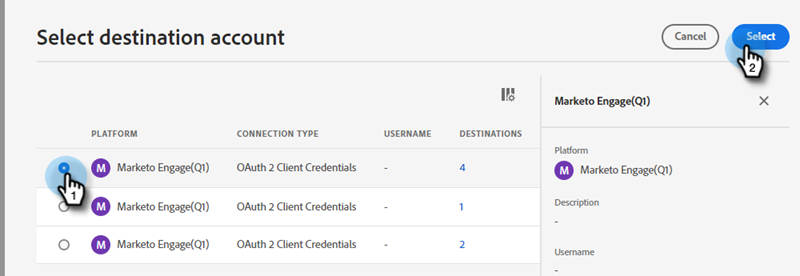
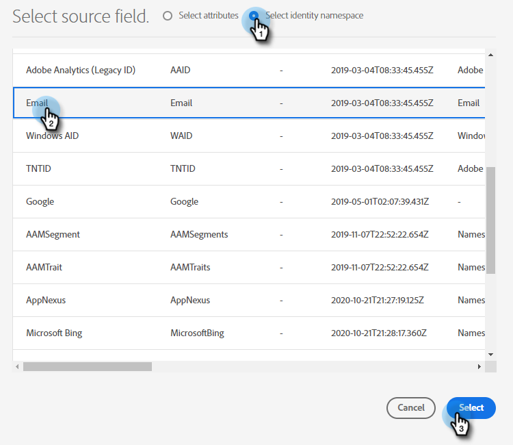

# Clonage push {#push-clone}

Cette fonctionnalité vous permet de transférer les segments situés dans votre Adobe Experience Platform vers Marketo sous la forme d’une liste statique.

>[!PREREQUISITES]
>
>* [Création d’un utilisateur API](/help/marketo/product-docs/administration/users-and-roles/create-an-api-only-user.md) dans Marketo.
>* Ensuite, accédez à **Administration** > **Launchpoint**. Recherchez le nom du rôle que vous venez de créer, puis cliquez sur **Afficher les détails**. Copiez et enregistrez les informations dans **ID client** et **Secret du client**, car vous en aurez besoin pour cette fonctionnalité.
>* Dans Marketo, créez une liste statique ou recherchez et sélectionnez-en une que vous avez déjà créée. Vous aurez besoin de son identifiant.

1. Connectez-vous à [Adobe Experience Platform](https://experience.adobe.com/).

   

1. Cliquez sur l’icône de grille et sélectionnez **Experience Platform**.

   

1. Dans le volet de navigation de gauche, cliquez sur **Destinations**.

   

1. Cliquez sur **Catalogue**.

   

1. Recherchez la mosaïque Marketo Engage et cliquez sur **Activation des segments**.

   

1. Cliquez sur **Configuration d’une nouvelle destination**.

   

1. Sous Type de compte, sélectionnez le bouton radio Compte existant ou Nouveau compte (dans cet exemple, nous choisissons **Compte existant**). Cliquez sur l’icône Sélectionner un compte .

   

   >[!NOTE]
   >
   >Si vous choisissez Nouveau compte, vous pouvez trouver votre Munchkin ID en accédant à **Administration** > **Munchkin** (il fait également partie de votre URL Marketo une fois connecté). Identifiant du client/secret que vous devez posséder en suivant les conditions préalables dans la partie supérieure de cet article.

1. Sélectionnez le compte de destination et cliquez sur **Sélectionner**.

   

1. Entrer une destination **Nom** et une description facultative. Cliquez sur la liste déroulante Création de personne et sélectionnez &quot;Faire correspondre les personnes Marketo existantes et créer des personnes manquantes dans Marketo&quot;. _ou_ &quot;Correspondance avec les personnes Marketo existantes uniquement.&quot; Dans cet exemple, nous choisissons le premier.

   

   >[!NOTE]
   >
   >Si vous choisissez &quot;Correspondance avec les personnes Marketo existantes uniquement&quot;, vous n’aurez qu’à mapper l’e-mail et/ou l’ECID, afin que vous puissiez ignorer les étapes 13 à 16.

1. Cette section est facultative. Cliquez sur **Créer** pour ignorer.

   

1. Sélectionnez la destination que vous avez créée, puis cliquez sur **Suivant**.

   

1. Sélectionnez le segment à envoyer à Marketo, puis cliquez sur **Suivant**.

   

   >[!NOTE]
   >
   >Si vous choisissez ici plusieurs segments, vous devrez associer chaque segment à une liste statique spécifiée dans l’onglet Planification de segments .

1. Cliquez sur **Ajouter un nouveau mappage**.

   

1. Cliquez sur l’icône de mappage.

   

1. Faites correspondre le prénom en sélectionnant **firstName** et clic **Sélectionner**.

   

1. Faites correspondre le nom et le nom de la société en cliquant sur **Ajouter un nouveau mappage** et répétez deux fois l’étape 15, en choisissant **lastName** puis **companyName**.

   

1. Il est maintenant temps de mapper l&#39;adresse email. Cliquez sur **Ajouter un nouveau mappage** encore une fois.

   

1. Cliquez sur l’icône de mappage.

   

1. Cliquez sur le bouton radio Sélectionner un espace de noms d’identité , choisissez  **Email**, puis cliquez sur **Sélectionner**.

   

   >[!IMPORTANT]
   >
   >Mappage de l’e-mail et/ou de l’ECID à partir de **Espace de noms d’identité** est la chose la plus importante à faire pour s’assurer que la personne correspond dans Marketo. Mapping Email garantit le taux de correspondance le plus élevé.

1. Il est maintenant temps de choisir les champs sources. Pour envoyer un courrier électronique, cliquez sur l’icône représentant un curseur.

   

1. Cliquez sur le bouton radio Sélectionner un espace de noms d’identité , recherchez et sélectionnez **Email**, puis cliquez sur **Sélectionner**.

   

1. Pour choisir le champ source Nom de la société , cliquez sur l’icône du curseur dans sa ligne.

   

1. Laissez le bouton radio Sélectionner un attribut coché. Recherchez &quot;company&quot; et sélectionnez **companyName**, puis cliquez sur **Sélectionner**.

   

1. Faites correspondre les champs source pour Nom et Prénom en cliquant sur l’icône du curseur pour chacun d’eux et en répétant deux fois l’étape 23, en choisissant **lastName** puis **firstName**.

   

1. Cliquez sur **Suivant**.

   

1. Vous aurez désormais besoin de l’identifiant de votre liste. Cliquez sur l’onglet de votre navigateur dans lequel votre liste statique Marketo est ouverte (ou ouvrez un nouvel onglet et sélectionnez la liste statique de votre choix).

   

   >[!NOTE]
   >
   >Pour de meilleurs résultats, utilisez une liste de Marketo Engage vide.

1. Mettez en surbrillance l’identifiant de liste et copiez-le à la fin de l’URL.

   

1. Collez l’ID que vous venez de copier sous ID de mappage et cliquez sur **Suivant**.

   

1. Cliquez sur **Terminer**.

   
