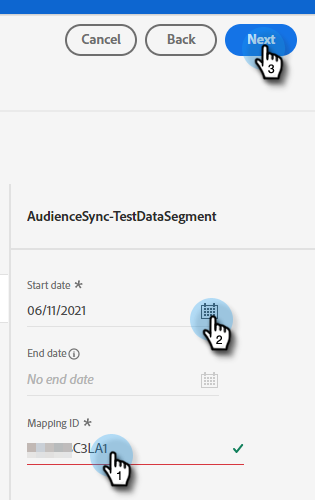

# Clonage push {#push-clone}

Cette fonctionnalité vous permet de transférer les segments situés dans votre Adobe Experience Platform vers Marketo sous la forme d’une liste statique.

>[!PREREQUISITES]
>
>* [Création d’un utilisateur API](/help/marketo/product-docs/administration/users-and-roles/create-an-api-only-user.md) dans Marketo.
>* Ensuite, accédez à **Administration** > **Launchpoint**. Recherchez le nom du rôle que vous venez de créer, puis cliquez sur **Afficher les détails**. Copiez et enregistrez les informations dans **ID client** et **Secret du client**, car vous en aurez besoin pour cette fonctionnalité.

1. Connectez-vous à [Adobe Experience Platform](https://experience.adobe.com/).

   

1. Cliquez sur l’icône de grille et sélectionnez **Experience Platform**.

   

1. Dans le volet de navigation de gauche, cliquez sur **Destinations**.

   

1. Cliquez sur **Catalogue**.

   

1. Recherchez la mosaïque Marketo Engage et cliquez sur **Activation des segments**.

   

1. Cliquez sur **Configuration d’une nouvelle destination**.

1. Sous Type de compte, sélectionnez Compte existant ou **Nouveau compte** Bouton radio (dans cet exemple, nous choisissons **Nouveau compte**). Saisissez vos informations d’identification Marketo.

   

   >[!NOTE]
   >
   >Vous pouvez trouver votre Munchkin ID en accédant à **Administration** > **Munchkin** (il fait également partie de votre URL Marketo une fois connecté). Identifiant du client/secret que vous devez posséder en suivant les conditions préalables dans la partie supérieure de cet article.

1. Sous Création de personne, sélectionnez &quot;Faire correspondre les personnes existantes uniquement&quot; ou &quot;Faire correspondre les personnes existantes et créer des personnes manquantes dans Marketo&quot;. Dans cette option, nous choisissons la seconde.

PICC

1. &quot;Connecté&quot; doit apparaître sous vos informations d’identification. Cliquez sur **Suivant** dans le coin supérieur droit.

   

1. Saisissez un **Nom** et un _facultatif_ Description. Cliquez sur **Création d’une destination**.

   >[!NOTE]
   >
   >Le choix d’un élément dans les actions marketing est également facultatif. Marketo n’exploite pas ces informations pour l’instant, mais le fera probablement bientôt.

   

1. Cliquez sur **Suivant**.

   

1. Sélectionnez le segment de votre choix, puis cliquez sur **Suivant**.

   

   >[!NOTE]
   >
   >Si vous choisissez ici plusieurs segments, vous devrez associer chaque segment à une liste statique spécifiée dans l’onglet Planification de segments .

1. Cliquez sur **Ajouter un nouveau mappage**.

   

1. Cliquez sur l’icône du curseur.

   

1. Choisissez l’une des options suivantes : **Sélectionner des attributs** ou **Sélectionner un espace de noms d’identité** Bouton radio (dans cet exemple, nous choisissons Attributs).

   

   >[!NOTE]
   >
   >Si vous choisissez **Sélectionner un espace de noms d’identité**, après avoir effectué votre sélection, passez à l’étape 15.

1. Sélectionnez le champ approprié qui contient l’adresse électronique qui identifie l’utilisateur. Cliquez sur **Sélectionner** une fois terminé.

   

   

   >[!NOTE]
   >
   >L’exemple que nous avons choisi peut sembler bien différent de votre sélection.

1. Cliquez sur l’icône de mappage.

   

1. Choisir **Sélectionner un espace de noms d’identité**.

   

   >[!IMPORTANT]
   >
   >Le mappage des attributs est facultatif. Mappage de l’e-mail et/ou de l’ECID à partir de **Espace de noms d’identité** est la chose la plus importante à faire pour s’assurer que la personne correspond dans Marketo. Mapping Email garantit le taux de correspondance le plus élevé.

1. Choisissez entre ECID ou Email. Dans cet exemple, nous choisissons **Email**.

   

1. Cliquez sur **Suivant**.

   

   >[!NOTE]
   >
   >Les identités sont utilisées pour rechercher des correspondances dans Marketo. Si une correspondance est trouvée, la personne est ajoutée à la liste statique. Si aucune correspondance n’est trouvée, ces personnes sont ignorées (c’est-à-dire qu’elles ne sont pas créées dans Marketo).

1. _Dans Marketo_, créez une liste statique ou recherchez et sélectionnez-en une que vous avez déjà créée. Copiez l’ID de mappage à partir de la fin de l’URL.

   

   >[!NOTE]
   >
   >Pour de meilleurs résultats, assurez-vous que la liste que vous référencez dans Marketo est vide.

1. De retour dans Adobe Experience Platform, saisissez l’identifiant que vous venez de copier. Sélectionnez votre Date de début. Les utilisateurs se synchronisent en permanence jusqu’à la date de fin choisie. Pour une synchronisation indéfinie, laissez la date de fin vide. Cliquez sur **Suivant** une fois terminé.

   

1. Confirmez vos modifications et cliquez sur **Terminer**.

   
