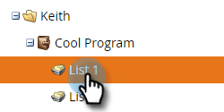
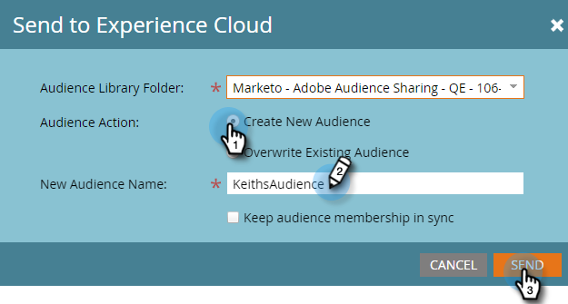

# Envoi d’une liste à Adobe Experience Cloud {#send-a-list-to-adobe-experience-cloud}

>[!NOTE]
>
>Un déploiement conforme à la loi HIPAA d’une instance Marketo Engage ne peut pas utiliser cette fonctionnalité.

>[!PREREQUISITES]
>
>[Configurer le mappage d’organisation Adobe](/help/marketo/product-docs/adobe-experience-cloud-integrations/set-up-adobe-organization-mapping.md){target="_blank"}

## Applications de destination prises en charge {#supported-destination-applications}

* Adobe Advertising Cloud
* Adobe Analytics (_uniquement_ si vous possédez une licence Adobe Audience Manager)
* Adobe Audience Manager
* Adobe Experience Manager
* Adobe Real-Time Customer Data Platform
* Adobe Target

## Comment envoyer une liste statique {#how-to-send-a-static-list}

Une liste statique, c&#39;est tout. Aucune modification ne sera apportée à la liste dans Adobe Experience Cloud à moins que vous ne les apportiez manuellement.

1. Dans Marketo, recherchez la liste à exporter. Cliquez dessus avec le bouton droit et sélectionnez **[!UICONTROL Envoyer à Experience Cloud]**.

   

1. Cliquez sur la liste déroulante **[!UICONTROL Dossier Audience Manager]** et sélectionnez le dossier de destination de votre choix dans Experience Cloud.

   

1. Choisissez de créer une audience ou de remplacer une audience existante (dans cet exemple, nous en créons une nouvelle). Saisissez le nouveau nom d’audience et cliquez sur **[!UICONTROL Envoyer]**.

   

1. Cliquez sur **[!UICONTROL OK]**.

   

   >[!NOTE]
   >
   >L’affichage complet de l’abonnement de l’audience dans Adobe peut prendre entre 6 et 8 heures.

## Comment envoyer une liste synchronisée {#how-to-send-a-synced-list}

La synchronisation d’une liste signifie que chaque fois que vous mettez à jour une liste dans Marketo, cette modification se synchronise automatiquement avec son audience dans Adobe Experience Cloud.

1. Dans Marketo, recherchez la liste à exporter. Cliquez dessus avec le bouton droit et sélectionnez **[!UICONTROL Envoyer à Experience Cloud]**.

   

1. Cliquez sur la liste déroulante **[!UICONTROL Dossier de la bibliothèque d’audiences]** et sélectionnez le dossier de destination de votre choix dans Experience Cloud.

   

1. Choisissez de créer une audience ou de remplacer une audience existante (dans cet exemple, nous en créons une nouvelle). Saisissez le nom de la nouvelle audience, cochez la case **[!UICONTROL Garder l’appartenance à l’audience synchronisée]**, puis cliquez sur **[!UICONTROL Envoyer]**.

   

1. Cliquez sur **[!UICONTROL OK]**.

   

## Comment arrêter une synchronisation de liste {#how-to-stop-a-list-sync}

Vous pouvez arrêter la synchronisation de votre liste à tout moment.

1. Dans Marketo, recherchez la liste dont vous souhaitez arrêter la synchronisation, puis cliquez dessus avec le bouton droit. Cliquez sur **[!UICONTROL Arrêter la synchronisation de la liste]**.

   

1. Sélectionnez la ou les audiences que vous souhaitez arrêter de synchroniser, puis cliquez sur **[!UICONTROL Arrêter]**.

   

1. Cliquez sur **[!UICONTROL Arrêter]** pour confirmer.

   

## Éléments à noter {#things-to-note}

### Partage vers Adobe Analytics {#sharing-to-adobe-analytics}

* Pour les utilisateurs qui possèdent à la fois Adobe Audience Manager et Adobe Analytics, cette intégration permet le partage des audiences de Marketo vers vos suites de rapports Adobe Analytics. Toutefois, des étapes de configuration supplémentaires doivent être effectuées dans Adobe Audience Manager pour activer ce partage. Veuillez consulter la [documentation de Adobe Audience Manager](https://experienceleague.adobe.com/docs/analytics/integration/audience-analytics/mc-audiences-aam.html?lang=fr){target="_blank"} pour plus d&#39;informations sur la configuration.

* Une fois qu’une liste est téléchargée de Marketo vers Adobe Audience Manager, elle est également accessible par Adobe Target. Cette configuration [doit être activée dans Adobe Target](https://experienceleague.adobe.com/fr/docs/target/using/integrate/audience-manager-target-integration){target="_blank"}.

* Si une liste est vide ou ne comporte aucune personne avec des valeurs ECID, le nom de la liste n’est pas transmis pour être référencé en dehors de Marketo.

### Utilisation des caractéristiques pour les clients Adobe Audience Manager {#trait-usage-aam}

Lorsque vous lancez une exportation de liste dans Marketo, vous remarquerez les modifications suivantes répercutées dans votre instance Adobe Audience Manager :

* Pour toutes les personnes de la liste exportée, Marketo écrira une caractéristique à l’aide de leurs e-mails hachés en tant qu’identifiant sur l’ensemble des appareils. Le nom de la caractéristique correspond au nom de l’audience de destination que vous avez spécifié lors de l’exportation.
* Pour tous les ECID que Marketo a réussi à faire correspondre aux personnes de la liste exportée, Marketo écrira une caractéristique à l’aide de l’identifiant d’appareil ECID. Le nom de la caractéristique correspond au nom de l’audience de destination que vous avez spécifié lors de l’exportation.
* Marketo crée également un segment dans votre instance Audience Manager en utilisant la caractéristique ECID comme seul critère de segmentation. Le nom du segment correspond au nom de l’audience de destination que vous avez spécifié lors de l’exportation.

## Questions fréquentes {#faq}

**Pourquoi la taille de la liste dans Marketo est-elle différente de celle dans Adobe ?**

L’intégration de l’audience fonctionne en synchronisant les cookies Munchkin Marketo avec le cookie ECID Adobe correspondant. Marketo ne peut partager des données d’abonnement que pour les personnes pour lesquelles Marketo a synchronisé un ECID. Pour des résultats optimaux, il est recommandé de charger le script de suivi munchkin.js de Marketo parallèlement au code de suivi visitor.js d’Adobe sur toutes les pages qui vous intéressent à des fins de marketing.

**Comment fonctionne la synchronisation des cookies ?**

Lorsque la synchronisation des cookies est activée pour votre abonnement Marketo, Marketo munchkin.js tente de capturer et de stocker les ECID Adobe pour l’organisation Adobe IMS que vous avez spécifiée lors de la configuration de l’intégration, puis de faire correspondre ces ECID à l’identifiant de cookie Marketo correspondant. Cela permet aux profils d’utilisateurs anonymes Marketo d’être enrichis avec les ECID Adobe.

Une étape supplémentaire est nécessaire pour associer le profil utilisateur anonyme à un profil de personne, qui est identifié à l’aide d’un e-mail en texte brut. Le fonctionnement exact est [décrit ici](/help/marketo/product-docs/reporting/basic-reporting/report-activity/tracking-anonymous-activity-and-people.md){target="_blank"}.

**Quelles informations sont partagées ?**

Cette intégration partage uniquement les informations d’appartenance à une liste de Marketo vers Adobe (par exemple, la connaissance du fait que la personne X est membre de la liste Y). Aucun attribut de personne supplémentaire n’est partagé avec Adobe via cette intégration.
