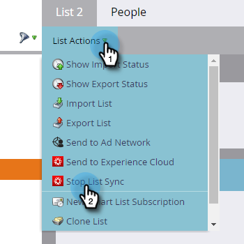

# Envoyer une Liste à Adobe Experience Cloud {#send-a-list-to-adobe-experience-cloud}

>[!NOTE]
>
>Un déploiement prêt pour la HIPAA d’une instance Marketo ne peut pas utiliser cette fonctionnalité.

>[!PREREQUISITES]
>
>[Configuration du partage des Audiences Adobe Experience Cloud](/help/marketo/product-docs/core-marketo-concepts/miscellaneous/set-up-adobe-experience-cloud-audience-sharing.md)

## Applications de destination prises en charge {#supported-destination-applications}

* Adobe Advertising Cloud
* Adobe Analytics (**uniquement** si vous possédez une licence Adobe Audience Manager)
* Adobe Audience Manager
* Gestionnaire d’expérience Adobe
* Plate-forme de données client en temps réel Adobe
* Adobe Target

## Comment envoyer une Liste statique {#how-to-send-a-static-list}

Une liste statique est juste ça, statique. Aucune modification ne sera apportée à la liste dans Adobe Experience Cloud, sauf si vous les apportez manuellement.

1. Dans Marketo, recherchez et sélectionnez la liste à exporter.

   

1. Cliquez sur la liste déroulante **Actions de Liste** et sélectionnez **Envoyer à l’Experience Cloud**.

   

1. Cliquez sur la liste déroulante **Dossier d’Audience Manager** et sélectionnez le dossier de destination de votre choix dans l’Experience Cloud.

   

1. Choisissez de créer une audience ou de remplacer une autre (dans cet exemple, nous en créons une nouvelle). Saisissez le nouveau nom de l’audience et cliquez sur **Envoyer**.

   

1. Cliquez sur **OK**.

   

   >[!NOTE]
   >
   >Il peut falloir jusqu&#39;à 6-8 heures pour que l&#39;audience puisse être pleinement inscrite à l&#39;Adobe.

## Comment envoyer une Liste synchronisée {#how-to-send-a-synced-list}

La synchronisation d’une liste signifie que chaque fois que vous mettez à jour une liste dans Marketo, la modification se synchronise automatiquement avec son audience dans Adobe Experience Cloud.

1. Dans Marketo, recherchez et sélectionnez la liste à synchroniser.

   

1. Cliquez sur la liste déroulante **Actions de Liste** et sélectionnez **Envoyer à l’Experience Cloud**.

   

1. Cliquez sur la liste déroulante **Dossier de bibliothèque d’Audiences** et sélectionnez le dossier de destination de votre choix dans l’Experience Cloud.

   

1. Choisissez de créer une audience ou de remplacer une autre (dans cet exemple, nous en créons une nouvelle). Saisissez le nouveau nom de l&#39;audience, cochez la case **Conserver l&#39;appartenance à l&#39;Audience dans Sync**, puis cliquez sur **Envoyer**.

   

1. Cliquez sur **OK**.

   

## Comment arrêter une synchronisation de Liste {#how-to-stop-a-list-sync}

Vous pouvez à tout moment empêcher votre liste de se synchroniser.

1. Dans Marketo, recherchez et sélectionnez la liste à arrêter de synchroniser.

   

1. Cliquez sur la liste déroulante **Actions de Liste** et sélectionnez **Arrêter la synchronisation des Listes**.

   

1. Sélectionnez la ou les audiences à ne plus synchroniser et cliquez sur **Arrêter**.

   

1. Cliquez sur **Arrêter** pour confirmer.

   

## Éléments à noter {#things-to-note}

**Partage en Adobe Analytics**

Pour les clients qui possèdent à la fois Adobe Audience Manager et Adobe Analytics, cette intégration permet le partage des audiences de Marketo vers vos suites de rapports Adobe Analytics. Toutefois, d’autres étapes de configuration doivent être effectuées dans Adobe Audience Manager pour activer cette intégration. Veuillez consulter la documentation de Adobe Audience Manager pour plus d’informations sur la façon de configurer ceci : [https://docs.adobe.com/content/help/en/analytics/integration/audience-analytics/mc-audiences-aam.html](https://docs.adobe.com/content/help/en/analytics/integration/audience-analytics/mc-audiences-aam.html).

**Utilisation des caractéristiques pour les clients Adobe Audience Manager**

Lorsque vous lancez une exportation de liste dans Marketo, vous remarquerez les modifications suivantes reflétées dans votre instance Adobe Audience Manager :

* Pour toutes les pistes de la Liste exportée, Marketo écrira une caractéristique en utilisant les courriers électroniques hachés des pistes comme identifiant multipériphériques. Le nom de la caractéristique correspondra au nom de l’Audience de destination que vous avez spécifié lors de l’exportation.
* Pour tous les ECID que Marketo a réussi à faire correspondre aux pistes de la Liste exportée, Marketo rédigera une caractéristique à l&#39;aide de l&#39;identifiant de périphérique ECID. Le nom de la caractéristique correspondra au nom de l’Audience de destination que vous avez spécifié lors de l’exportation.
* Marketo crée également un segment dans votre instance d’Audience Manager en utilisant la caractéristique ECID comme seul critère de segmentation. Le nom du segment correspondra au nom de l’Audience de destination que vous avez spécifié lors de l’exportation.

## FAQ {#faq}

**Pourquoi la taille de la liste dans Marketo est-elle différente de celle de l&#39;Adobe ?**

Sous le capot, l’intégration des audiences fonctionne en synchronisant les cookies Marketo Munchkin avec le cookie ECID d’Adobe correspondant. Marketo ne peut partager que les données d&#39;adhésion pour les pistes pour lesquelles Marketo a synchronisé un ECID. Pour un résultat optimal, il est recommandé de charger le script de suivi munchkin.js de Marketo en parallèle avec le code de suivi visiteur.js d’Adobe sur toutes les pages que vous souhaitez suivre à des fins marketing.

**Comment fonctionne la synchronisation des cookies ?**

Lorsque la synchronisation des cookies est activée pour votre Abonnement Marketo, le fichier munchkin.js de Marketo tente de capturer et de stocker les ECID d’Adobe pour l’organisation IMS d’Adobe que vous avez spécifiée lors de la configuration de l’intégration et de faire correspondre ces ECID à l’identifiant de cookie Marketo correspondant. Cela permet aux profils utilisateurs anonymes de Marketo de s’enrichir avec des ECID d’Adobe.

Une autre étape est nécessaire pour associer le profil d’utilisateur anonyme à un Profil de piste, qui est identifié à l’aide d’un courrier électronique en texte brut. La façon exacte dont cela fonctionne est [décrite ici](/help/marketo/product-docs/reporting/basic-reporting/report-activity/tracking-anonymous-activity-and-people.md).

**Quelles informations sont partagées ?**

Cette intégration ne partage que les informations d&#39;adhésion à la liste de Marketo à l&#39;Adobe (par exemple, la connaissance que le prospect X est membre de la Liste Y). Aucun autre attribut de piste n&#39;est partagé à l&#39;Adobe via cette intégration.
