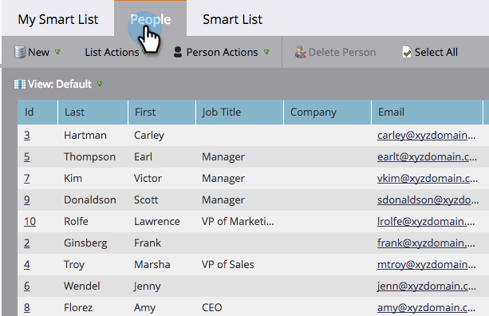

# Comprendre les listes dynamiques {#understanding-smart-lists}

Les listes dynamiques vous permettent de trouver des groupes spécifiques de personnes à l’aide de filtres simples. Elles sont utilisées dans tout Marketo, par exemple dans les campagnes intelligentes, les programmes, les rapports, les segmentations, les business models, les programmes d’engagement, le contenu dynamique, etc. Selon vos besoins, les listes dynamiques peuvent être créées à deux endroits dans Marketo :

1. dans la **Base de données**, où ils sont disponibles pour une utilisation partagée/globale (par exemple, « Toutes les personnes désabonnées »).
1. Dans les **programmes** en tant qu’actifs locaux, où ils trouvent un groupe de personnes pertinentes pour ce programme spécifique (par exemple, « Salon professionnel auquel ils ont participé »).

Les étapes principales de la création d’une liste dynamique sont les suivantes :

1. [Créer une liste dynamique](/help/marketo/product-docs/core-marketo-concepts/smart-lists-and-static-lists/creating-a-smart-list/create-a-smart-list.md){target="_blank"}
1. [Rechercher et ajouter des filtres à une liste dynamique](/help/marketo/product-docs/core-marketo-concepts/smart-lists-and-static-lists/creating-a-smart-list/find-and-add-filters-to-a-smart-list.md){target="_blank"}
1. [Définir des filtres de liste dynamique](/help/marketo/product-docs/core-marketo-concepts/smart-lists-and-static-lists/creating-a-smart-list/define-smart-list-filters.md){target="_blank"}

Voici un exemple de ce à quoi ressemble une liste dynamique.

## Onglet Principal {#main-tab}

Vous pouvez [modifier le nom de la liste dynamique](/help/marketo/product-docs/core-marketo-concepts/miscellaneous/rename-a-marketo-asset.md){target="_blank"} et afficher des informations sur la liste dynamique.

## Onglet Personnes {#people-tab}

C’est là que vous voyez vos résultats, c’est-à-dire toutes les personnes qui remplissent les critères pour les filtres que vous [avez ajoutés et définis](/help/marketo/product-docs/core-marketo-concepts/smart-lists-and-static-lists/creating-a-smart-list/find-and-add-filters-to-a-smart-list.md){target="_blank"} sous l’onglet Liste dynamique .

## Onglet Liste dynamique {#smart-list-tab}

Vous ajoutez et définissez les filtres pour afficher un groupe spécifique de personnes dans l’onglet [!UICONTROL Personnes].

OK, commençons !

>[!MORELIKETHIS]
>
>* [Utiliser des listes dynamiques système/intégrées](/help/marketo/product-docs/core-marketo-concepts/smart-lists-and-static-lists/using-smart-lists/use-built-in-system-smart-lists.md){target="_blank"}
>* [Créer une liste dynamique](/help/marketo/product-docs/core-marketo-concepts/smart-lists-and-static-lists/creating-a-smart-list/create-a-smart-list.md){target="_blank"}
