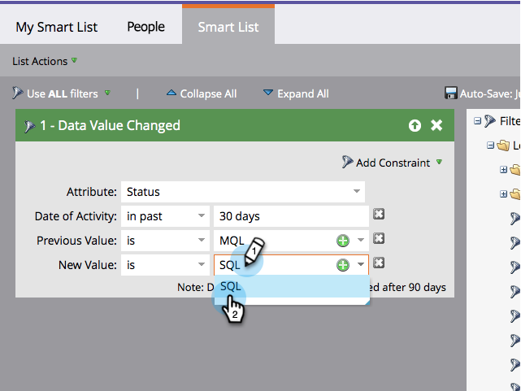

# Ajouter une contrainte à un filtre de Liste dynamique {#add-a-constraint-to-a-smart-list-filter}

Lors de la création de listes intelligentes, certains filtres ont des options avancées appelées *contraintes. *Il s&#39;agit de conditions supplémentaires que vous pouvez ajouter aux filtres et déclencheurs pour vous aider à limiter encore davantage votre recherche.

Dans cet exemple, ajoutons quelques contraintes à un filtre ** Valeur de [données modifiée](../../../../product-docs/core-marketo-concepts/smart-campaigns/flow-actions/change-data-value.md)** pour rechercher les personnes qui ont subi un changement d’état de MQL en SQL.

>[!NOTE]
>
>**FYI**
>
>Marketo est maintenant en train de normaliser la langue dans tous les abonnements. Vous pouvez donc voir des pistes dans votre abonnement et des personnes/personnes dans docs.marketo.com. Ces termes signifient la même chose ; cela n&#39;a aucune incidence sur les instructions relatives aux articles. Il y a aussi d&#39;autres changements. [En savoir plus](http://docs.marketo.com/display/DOCS/Updates+to+Marketo+Terminology).

>[!PREREQUISITES]
>
>* [Création d’une Liste dynamique](../../../../product-docs/core-marketo-concepts/smart-lists-and-static-lists/creating-a-smart-list/create-a-smart-list.md)
>* [Utiliser le filtre &quot;Valeur des données modifiée&quot; dans une Liste dynamique](use-the-data-value-changed-filter-in-a-smart-list.md)

>

1. Accédez à Activités **** marketing.

   

1. Sélectionnez la liste intelligente avec un filtre auquel vous allez ajouter une contrainte, puis cliquez sur l&#39;onglet Liste **** intelligente.

   

1. Sous Contrainte **d&#39;Ajoute**, sélectionnez Valeur **** précédente.

   

1. Saisissez la valeur **** précédente. Dans cet exemple, nous utilisons MQL.

   

1. Sous **Ajouter la contrainte**, sélectionnez **Nouvelle valeur**.

   

1. Saisissez la **nouvelle valeur**. Dans cet exemple, nous utilisons SQL.

   

1. Bien joué ! Cliquez sur l’onglet **Personnes** pour afficher toutes les personnes qui ont eu un **état** de changement de **MQL** à **SQL au cours des 30 derniers jours.**

