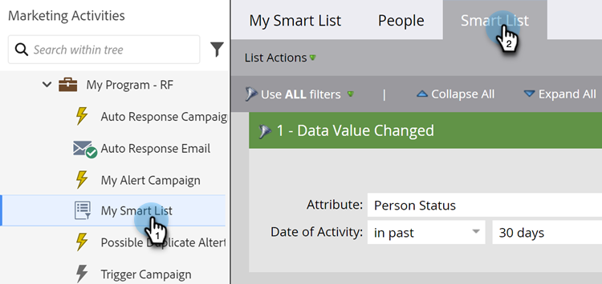

# Ajout d’une contrainte à un filtre de liste dynamique {#add-a-constraint-to-a-smart-list-filter}

Lors de la création d’une liste dynamique, certains filtres disposent d’options avancées appelées &quot;contraintes&quot;. Il s’agit de conditions supplémentaires que vous pouvez ajouter aux filtres et aux triggers pour affiner encore davantage votre recherche.

Dans cet exemple, ajoutons quelques contraintes à un filtre **[Valeur de données modifiée](/help/marketo/product-docs/core-marketo-concepts/smart-campaigns/flow-actions/change-data-value.md){target="_blank"}** pour rechercher les personnes qui ont subi un changement d’état de MQL à SQL.

>[!PREREQUISITES]
>
>* [Créer une liste dynamique](/help/marketo/product-docs/core-marketo-concepts/smart-lists-and-static-lists/creating-a-smart-list/create-a-smart-list.md){target="_blank"}
>* [Utiliser le filtre &quot;Valeur de données modifiée&quot; dans une liste dynamique](/help/marketo/product-docs/core-marketo-concepts/smart-lists-and-static-lists/using-smart-lists/use-the-data-value-changed-filter-in-a-smart-list.md){target="_blank"}

1. Accédez à **[!UICONTROL Activités marketing]**.

   

1. Sélectionnez la liste dynamique avec un filtre auquel vous allez ajouter une contrainte et cliquez sur l’onglet **[!UICONTROL Liste dynamique]** .

   

1. Sous **[!UICONTROL Ajouter une contrainte]**, sélectionnez **[!UICONTROL Valeur précédente]**.

   

1. Saisissez la **[!UICONTROL Valeur précédente]**. Dans cet exemple, nous utilisons MQL.

   

1. Sous **[!UICONTROL Ajouter une contrainte]**, sélectionnez **[!UICONTROL Nouvelle valeur]**.

   

1. Saisissez la nouvelle valeur. Dans cet exemple, nous utilisons SQL.

   

1. C&#39;est joli ! Cliquez sur l’onglet **[!UICONTROL Personnes]** pour afficher toutes les personnes qui ont eu un changement d’état de &quot;MQL&quot; à &quot;SQL&quot; au cours des 30 derniers jours.
