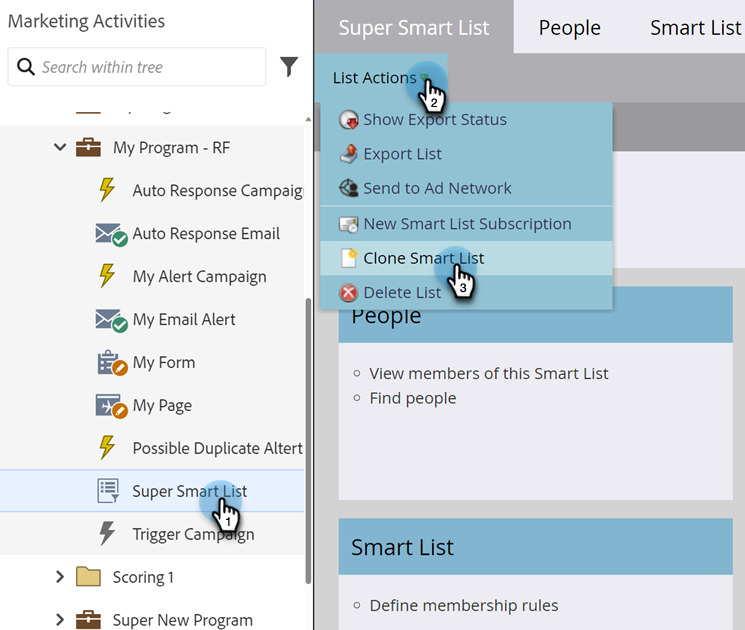

# Cloner une liste ou une liste intelligente {#clone-a-list-or-smart-list}

Au lieu de créer une liste dynamique à partir de zéro, gagnez du temps en clonant une liste similaire et en y apportant des modifications. Voici comment faire.

1. Accédez à **[!UICONTROL Activités marketing]**.

   

1. Sélectionnez la liste dynamique à cloner. Sous **[!UICONTROL Actions de liste]**, cliquez sur **[!UICONTROL Cloner la liste dynamique]**.

   

1. Saisissez un **[!UICONTROL Nom]** et cliquez sur **[!UICONTROL Cloner]**.

   

Joli travail ! Vous pouvez également cloner les listes normales de la même manière.
