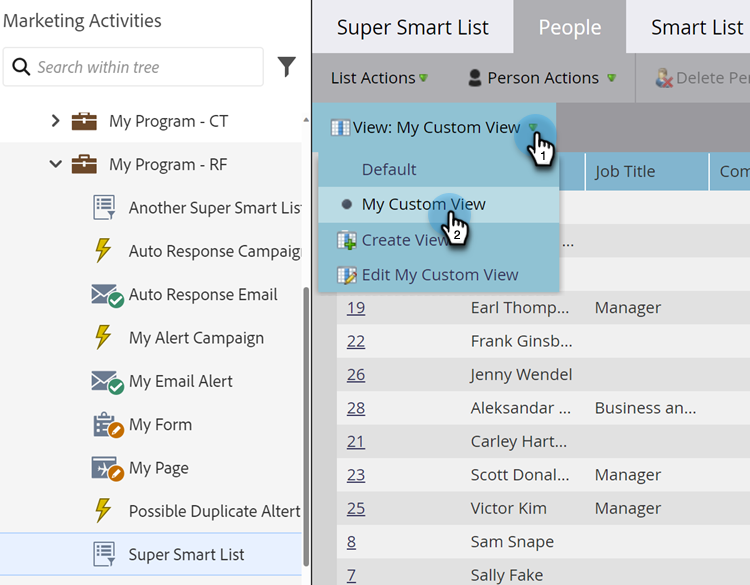
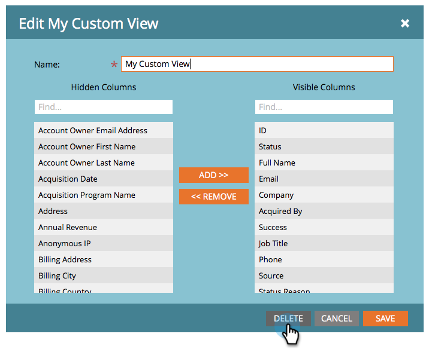

# Création et modification des vues des listes et des listes dynamiques {#create-and-change-views-for-lists-and-smart-list}

Une liste dynamique affiche un ensemble de colonnes par défaut. Saviez-vous que vous pouviez modifier ces colonnes à votre guise ? Voici comment procéder.

## Création d’une vue {#create-a-view}

1. Accédez à une liste ou à une liste dynamique, cliquez sur l’onglet **[!UICONTROL Personnes]**, puis sur **[!UICONTROL Créer une vue]** dans la liste déroulante **[!UICONTROL Vue]**.

   

1. Nommez la vue et recherchez la colonne à ajouter ou à supprimer.

   

1. Ajoutez/supprimez les colonnes souhaitées, puis cliquez sur **[!UICONTROL Créer]**.

   

>[!TIP]
>
>Pour rechercher rapidement, utilisez la zone **[!UICONTROL Rechercher]**.

## Changer de vues {#switch-views}

1. Cliquez sur la liste déroulante **[!UICONTROL Vue]**, puis sélectionnez la vue de votre choix. Basculez d’avant en arrière entre les vues selon les besoins.

   

>[!NOTE]
>
> Vous devez d&#39;abord créer une deuxième vue, en plus de la vue par défaut, afin de changer de vue.

## Modification d’une vue {#edit-a-view}

1. Assurez-vous que la vue que vous souhaitez modifier est sélectionnée dans la liste déroulante **[!UICONTROL Vue]**.

   

1. Cliquez sur l’option **[!UICONTROL Modifier]**.

   

1. Apportez les modifications souhaitées, puis cliquez sur **[!UICONTROL Enregistrer]**.

   

## Suppression d’une vue {#delete-a-view}

1. Sélectionnez l’option **[!UICONTROL Modifier]** pour la vue à supprimer dans la liste déroulante **[!UICONTROL Vue]**.

   

1. Cliquez sur **[!UICONTROL Supprimer]**.

   

Vous seul pouvez voir les vues personnalisées que vous créez dans le menu déroulant Vue. Dites donc à vos amis qu’ils doivent créer les leurs !

>[!MORELIKETHIS]
>
>* [Utiliser des listes dynamiques système/intégrées](/help/marketo/product-docs/core-marketo-concepts/smart-lists-and-static-lists/using-smart-lists/use-built-in-system-smart-lists.md){target="_blank"}
>* [Créer une liste dynamique](/help/marketo/product-docs/core-marketo-concepts/smart-lists-and-static-lists/creating-a-smart-list/create-a-smart-list.md){target="_blank"}
