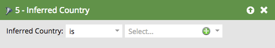

# Filtres déduits {#inferred-filters}

Lorsqu’un visiteur se rend sur votre site Web, [Munchkin](/help/marketo/product-docs/administration/additional-integrations/add-munchkin-tracking-code-to-your-website.md){target="_blank"} les cookies et les met dans le système. Nous recherchons leur adresse IP dans une base de données spéciale et en déduire toutes sortes d&#39;informations.

>[!NOTE]
>
>Pour garantir que les valeurs de champ déduites restent à jour, nous mettons régulièrement à jour la base de données utilisée pour les recherches d’adresses IP. Les mises à jour de la base de données peuvent introduire de nouvelles valeurs de champ déduites que vous devrez peut-être ajouter aux définitions de filtre de liste dynamique.
>
>Les mises à jour de la base de données peuvent se produire lors d’une [version de produit Marketo Engage](/help/marketo/release-notes/release-schedule.md){target="_blank"}. Lorsqu’une mise à jour se produit, les [notes de mise à jour du Marketo Engage](/help/marketo/release-notes/current.md){target="_blank"} contiennent une explication de toute modification des valeurs de champ déduites.

Lorsque vous utilisez l’un de ces filtres dans une liste dynamique, les résultats génèrent des personnes avec ces informations déduites.

>[!TIP]
>
>Utilisez ces filtres dans un rapport d’activité web. Utilisez les territoires des représentants commerciaux et abonnez-les à un rapport quotidien personnalisé avec les visiteurs du site Web au cours des dernières 24 heures. Ils vont l&#39;adorer !
>
>* Page Web visitée - 24 dernières heures
>* L’état déduit est [sélectionner leur territoire]

Ces visiteurs anonymes sont automatiquement transformés en personnes lorsqu’ils cliquent sur un lien d’email ou remplissent un formulaire. Cependant, ils conservent toutes les informations déduites.

>[!NOTE]
>
>En savoir plus sur [l’activité anonyme et les pistes](/help/marketo/product-docs/core-marketo-concepts/smart-lists-and-static-lists/managing-people-in-smart-lists/understanding-anonymous-activity-and-people.md){target="_blank"}.
