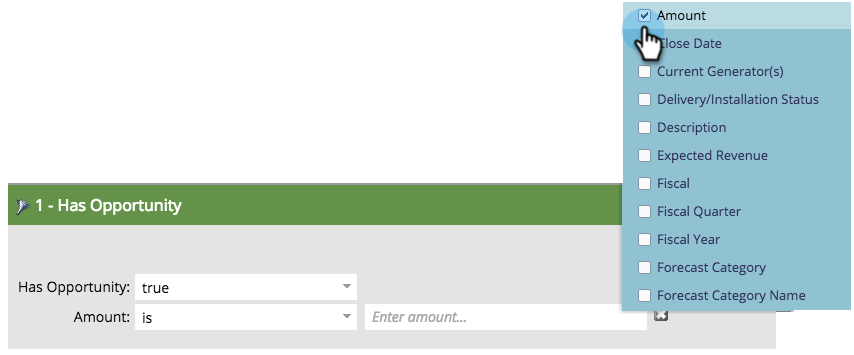
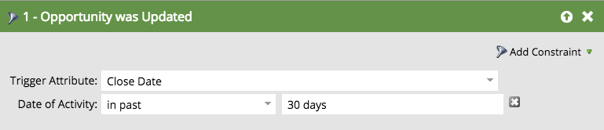
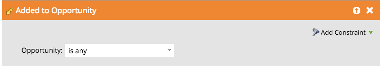

# Filtres et triggers d’opportunité {#opportunity-filters-and-triggers}

Les filtres et triggers d’opportunité permettent d’effectuer le suivi des événements d’opportunité depuis [!DNL Salesforce]. Ils sont un peu différents des autres filtres et déclencheurs.

## Filtres d’opportunités {#opportunity-filters}

Les filtres d’opportunité vous permettent d’accéder à vos prospects Salesforce qui ont des opportunités. Vous pouvez les trouver dans le dossier Opportunités de la palette lors de la modification d&#39;une liste dynamique. Ils sont disponibles en plusieurs versions.

* Nombre d&#39;opportunités
* Montant total de l&#39;opportunité
* Total du chiffre d&#39;affaires souhaité de l&#39;opportunité
* A une opportunité
* Opportunité ajoutée
* L’opportunité a été supprimée
* Opportunité mise à jour

Si vous recherchez vos champs d’opportunité (personnalisés ou standard), utilisez le filtre **A une opportunité** ou **L’opportunité était`[Added/Removed/Updated]`** des filtres ou des déclencheurs.

**Nombre d’options, montant total de l’option, chiffre d’affaires total attendu de l’option**

Grâce à ces filtres, vous pouvez trouver des prospects en fonction du nombre total, du montant ou du chiffre d’affaires attendu de toutes leurs opportunités.

**A une opportunité, A été ajouté à l’opportunité, A été supprimé de l’opportunité**

Si vous recherchez des prospects qui ont des opportunités basées sur une combinaison de critères, utilisez le filtre **A une opportunité**, **A été ajouté à l’opportunité** ou **A été supprimé de l’opportunité**. Ils vous disent :

* **A une opportunité** : si ce prospect a actuellement une opportunité correspondante
* **A été ajouté à l’opportunité** : si ce prospect a déjà été ajouté à une opportunité correspondante
* **A été supprimé de l’opportunité** : si ce prospect a déjà été supprimé d’une opportunité correspondante

Ajoutez les critères de recherche en tant que **Contraintes** sur le filtre. Les contraintes incluent vos champs standard d’opportunité et personnalisés :

Supposons, par exemple, que vous souhaitiez trouver des prospects qui ont des opportunités ouvertes d’au moins 5 000 $. Faites glisser le filtre **A une opportunité** et utilisez les contraintes **Est fermé** et **Montant** :

>[!NOTE]
>
>Lorsque vous utilisez plusieurs filtres d’opportunité, vous pouvez obtenir des réponses incorrectes. Si vous avez créé l’exemple ci-dessus avec deux filtres d’opportunité, vous obtiendrez une liste de prospects ayant une opportunité d’au moins 5 000 $ et toute opportunité fermée, même s’il s’agit d’opportunités distinctes.

**Opportunité mise à jour**

Le filtre **Opportunité mise à jour** recherche toute opportunité lorsqu’un champ d’opportunité spécifique a été mis à jour. Sélectionnez le champ à vérifier à l’aide du menu déroulant Attribut de déclencheur , puis utilisez les contraintes pour réduire l’ensemble des modifications.

Par exemple, ce filtre vous affichera tous les prospects dont la date de clôture a changé au cours des 30 derniers jours :

## Déclencheurs d’opportunité {#opportunity-triggers}

Les déclencheurs d’opportunité suivants sont disponibles. Ils fonctionnent comme leurs filtres correspondants (décrits précédemment), sauf qu’ils peuvent déclencher des campagnes juste lorsque l’événement se produit :

* Mise à jour de l&#39;opportunité
* Ajouté à l&#39;opportunité
* Supprimé de l&#39;opportunité

Par exemple, vous pouvez utiliser cette liste dynamique pour déclencher lorsqu’un prospect est ajouté à une opportunité. Dans le flux, vous pouvez les ajouter à la liste Marketing suspendu ou leur envoyer un e-mail ciblé.

Pour déclencher les champs personnalisés de votre opportunité, utilisez le déclencheur **L’opportunité est mise à jour** puis sélectionnez le champ dans le menu déroulant :

