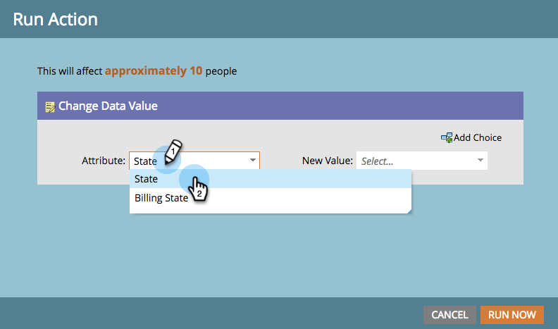

# Exécution d’une étape de flux unique à partir d’une Liste dynamique {#run-a-single-flow-step-from-a-smart-list}

Si vous souhaitez exécuter une seule étape de flux, vous pouvez utiliser une seule étape de flux dans une liste dynamique au lieu de créer une campagne dynamique complète.

>[!NOTE]
>
>**Conditions préalables**
>
>* [Création d’une Liste dynamique](../../../../product-docs/core-marketo-concepts/smart-lists-and-static-lists/creating-a-smart-list/create-a-smart-list.md)

>

1. Accédez à Activités **** marketing.

   

1. Sélectionnez une liste ou une liste intelligente comportant des personnes, puis accédez à l’onglet **Personnes** .

   

   >[!TIP]
   >
   >Les listes statiques et les listes intelligentes disposent de cette fonctionnalité.

1. Cliquez sur **Sélectionner tout**. Vous pouvez également utiliser** Ctrl/Cmd** et cliquer pour sélectionner quelques enregistrements manuellement.

   

   >[!NOTE]
   >
   >Si les résultats s’étendent sur plusieurs pages, cliquez sur **Sélectionner tout** pour sélectionner toutes les personnes sur toutes les pages.

1. Sous **Actions** personnelles ****, sélectionnez l’étape de flux de votre choix. Dans cet exemple, nous utiliserons [Changer la valeur](../../../../product-docs/core-marketo-concepts/smart-campaigns/flow-actions/change-data-value.md)des données.

   

1. Recherchez et sélectionnez un **attribut**. Dans cet exemple, nous prendrons toutes les personnes ayant l’état &quot;Californie&quot; et le remplacerons par &quot;CA&quot;.

   

1. Saisissez une nouvelle valeur. Cliquez sur **Exécuter maintenant**.

   

1. Si vous modifiez les valeurs de données pour un grand nombre de personnes, vous devrez peut-être confirmer la modification en entrant le numéro. Cliquez sur **Aller pour**.

   

Un travail formidable ! L’état de l’étape de flux unique s’affiche dans le coin supérieur droit.

Une fois terminé, actualisez la liste et vous verrez les informations mises à jour.
