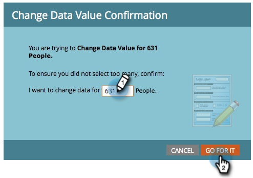
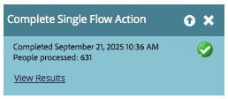

# Exécuter une seule étape de flux à partir d’une liste intelligente {#run-a-single-flow-step-from-a-smart-list}

Si vous souhaitez exécuter une seule étape de flux unique, vous pouvez utiliser une seule étape de flux dans une liste dynamique au lieu de créer une campagne dynamique entière.

>[!PREREQUISITES]
>
>[Créer une liste dynamique](/help/marketo/product-docs/core-marketo-concepts/smart-lists-and-static-lists/creating-a-smart-list/create-a-smart-list.md){target="_blank"}

1. Accédez à **[!UICONTROL Activités marketing]**.

   

1. Sélectionnez une liste ou une liste dynamique contenant des personnes, puis accédez à l’onglet **[!UICONTROL Personnes]**.

   

   >[!TIP]
   >
   >Les listes statiques et les listes dynamiques disposent de cette fonctionnalité.

1. Cliquez sur **[!UICONTROL Tout sélectionner]**. Vous pouvez également utiliser **Ctrl/Cmd** et cliquer sur pour sélectionner manuellement quelques enregistrements.

   

   >[!NOTE]
   >
   >Si les résultats s’étendent sur plusieurs pages, le fait de cliquer sur **[!UICONTROL Tout sélectionner]** sélectionne toutes les personnes sur toutes les pages.

1. Sous **[!UICONTROL Actions de personne]**, sélectionnez l’étape de flux de votre choix. Dans cet exemple, nous utiliserons [Modifier la valeur des données](/help/marketo/product-docs/core-marketo-concepts/smart-campaigns/flow-actions/change-data-value.md){target="_blank"}.

   

1. Recherchez et sélectionnez un **[!UICONTROL attribut]**. Dans cet exemple, nous allons prendre toutes les personnes dont l’état est « California » et le remplacer par « CA ».

   

1. Saisissez une nouvelle valeur. Cliquez sur **[!UICONTROL Exécuter maintenant]**.

   

1. Si vous modifiez les valeurs de données pour un grand nombre de personnes, vous devrez peut-être confirmer la modification en saisissant le nombre. Cliquez Sur **[!UICONTROL Y Accéder]**.

   

Un travail génial ! Le statut de l’étape de flux unique s’affiche dans le coin supérieur droit.

Lorsque vous avez terminé, actualisez la liste pour afficher les informations mises à jour.
