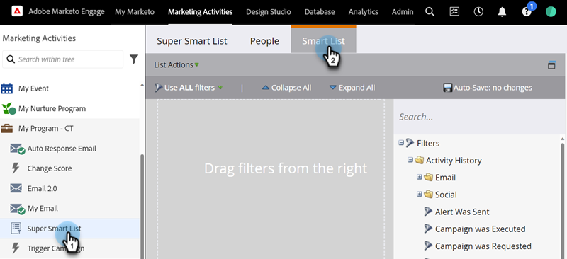

# Utiliser des filtres d’inactivité dans une liste intelligente {#use-inactivity-filters-in-a-smart-list}

Utilisez les filtres d’inactivité pour trouver les personnes d’une liste dynamique qui n’ont rien fait.

1. Accédez à **[!UICONTROL Activités marketing]**.

   

1. Sélectionnez la liste dynamique à modifier, puis cliquez sur l&#39;onglet **[!UICONTROL Liste dynamique]**.

   

1. Recherchez le filtre d’inactivité de votre choix et faites-le glisser dans la zone de travail. À titre d’exemple, cet exemple recherche des personnes qui n’ont visité aucune de vos pages.

   

   >[!TIP]
   >
   >Le dossier **[!UICONTROL Filtres d’inactivité]** contient de nombreux filtres. Recherchez « Not » et explorez-les.

1. Sélectionnez l’opérateur **[!UICONTROL n’importe lequel]**. Toutes les personnes qui n’ont visité aucune page au cours des 30 derniers jours seront trouvées.

   
