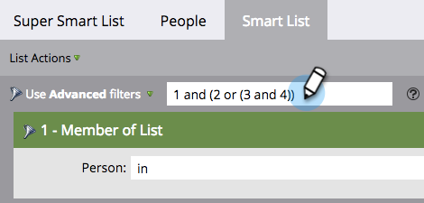

# Utilisation de la logique avancée de règle de liste intelligente {#using-advanced-smart-list-rule-logic}

Vous pouvez trouver exactement les personnes dont vous avez besoin en appliquant la logique de règle de liste dynamique à plusieurs filtres d’une liste dynamique. Voici comment faire.

>[!PREREQUISITES]
>
>* [Rechercher et ajouter des filtres à une liste dynamique](/help/marketo/product-docs/core-marketo-concepts/smart-lists-and-static-lists/creating-a-smart-list/find-and-add-filters-to-a-smart-list.md){target="_blank"}
>* [Définir des filtres de liste dynamique](/help/marketo/product-docs/core-marketo-concepts/smart-lists-and-static-lists/creating-a-smart-list/define-smart-list-filters.md){target="_blank"}

>[!NOTE]
>
>La logique de filtre avancé n’est disponible que si votre liste dynamique comporte trois filtres ou plus.

## Ajouter une logique à une liste dynamique {#add-logic-to-a-smart-list}

Par défaut, votre liste dynamique recherche les personnes qui correspondent aux filtres **[!UICONTROL TOUS]** (filtres 1 _et_ 2 _et_ 3). Vous pouvez modifier la logique des règles pour rechercher des personnes qui correspondent à **[!UICONTROL ANY]** des filtres définis (filtres 1 _ou_ 2 _ou_ 3) ou utiliser des filtres avancés (filtres 1 _et_ 2 _ou_ 3).

Dans cet exemple, supposons que vous souhaitiez trouver des personnes en Californie _et_ avec un score d’au moins 50 points _ou_ avec un statut « Qualifié pour les ventes ».

1. Sélectionnez **[!UICONTROL Utiliser des filtres avancés]** dans la liste déroulante.

   

   >[!NOTE]
   >
   >L’utilisation de filtres **[!UICONTROL avancés]** réduit la nécessité de créer des listes dynamiques avec le filtre Membre de liste dynamique . Cela permet d’optimiser les performances.

1. La zone de texte **[!UICONTROL Filtres avancés]** affiche « et » comme valeur par défaut entre tous vos filtres.

   

1. Saisissez une paire de parenthèses autour de « 2 et 3 ».

   

   >[!CAUTION]
   >
   >Vous devez utiliser « and » avant « or » lors de la saisie de la logique de règle.

1. Remplacez « and » entre « 2 et 3 » par « or ».

   

## Utilisez des parenthèses lors du mélange de « And » et « Or ». {#use-parentheses-when-mixing-and-and-or}

Le mélange de la logique « and » et « or » nécessite des parenthèses pour clarifier votre intention.

## Utilisez des parenthèses imbriquées pour quatre filtres ou plus si nécessaire. {#use-nested-parentheses-for-four-or-more-filters-if-needed}

Selon votre intention, vous devrez peut-être ajouter des parenthèses imbriquées lors de l’utilisation de quatre filtres ou plus.

>[!TIP]
>
>Si vous saisissez une règle non valide, une ligne rouge s’affiche sous la règle. Faites défiler le texte pour afficher le message d’erreur associé.
