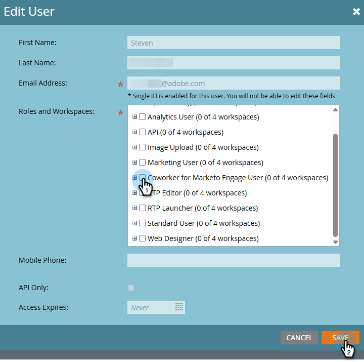

# Paramètres et configuration {#settings-setup}

Découvrez comment activer des autorisations et utiliser la zone Paramètres pour afficher les détails de connexion, définir des règles d’organisation et configurer des intégrations et des notifications.

>[!AVAILABILITY]
>
>Cette fonctionnalité est disponible pour tous les abonnements. Si la mosaïque Collègues pour Marketo Engage ne s’affiche pas sur votre écran Mon Marketo, contactez votre gestionnaire de compte. Vous devez également accepter les termes [&#x200B; Core Gen-AI et les termes supplémentaires](https://www.adobe.com/legal/terms/enterprise-licensing/genai-ww.html){target="_blank"}.

## Autorisations et rôles {#permission-and-role}

Il existe une autorisation _Accéder à un collègue pour Marketo Engage_ et un rôle _Collègue pour un utilisateur Marketo Engage_, qui permettent aux administrateurs et administratrices de mieux contrôler quels utilisateurs et utilisatrices peuvent accéder à la fonction **Collègue pour Marketo Engage**. L’autorisation est affectée au niveau du rôle. Le rôle _Collègue de l’utilisateur Marketo Engage_ est fourni avec l’autorisation _Accéder au collaborateur de Marketo Engage_ activée par défaut.

>[!NOTE]
>
>L’autorisation _Accéder à un collègue pour Marketo Engage_ n’est pas activée par défaut pour tous les rôles. Voir le tableau ci-dessous pour plus de détails.

| Rôle | Statut par défaut |
| --- | --- |
| Administration | Activé |
| Administrateur de produits Adobe | Activé |
| Utilisateur marketing | Désactivé |
| Utilisateur standard | Non disponible |
| Collègue pour un utilisateur Marketo Engage | Activé |
| Rôles personnalisés | Désactivé |

### Accéder à l’autorisation Coworker for Marketo Engage {#access-coworker-marketo-permission}

Suivez les étapes ci-dessous pour activer _Access Coworker for Marketo Engage_ pour les rôles qualifiés qui ne l’ont pas déjà activé.

1. Dans Mon Marketo, cliquez sur **Admin**, puis **Utilisateurs et rôles**.

   

1. Dans l’onglet _Rôles_, sélectionnez le rôle souhaité, puis cliquez sur **Modifier le rôle**.

   

1. Faites défiler vers le bas et cochez la case _Accéder à un collègue pour Marketo Engage_, puis cliquez sur **Enregistrer**.

   

   >[!NOTE]
   >
   >Vous pouvez suivre les mêmes étapes pour supprimer l’autorisation en **décochant** la case _Accéder à un collègue pour Marketo Engage_.

### Collègue de rôle d’utilisateur Marketo Engage {#coworker-marketo-user-role}

Pour affecter un utilisateur spécifique au rôle _Collègue d’un utilisateur Marketo Engage_, procédez comme suit.

>[!NOTE]
>
>Ce rôle **uniquement** contient l’autorisation _Accéder au collègue pour Marketo Engage_.

1. Dans Mon Marketo, cliquez sur **Admin**, puis **Utilisateurs et rôles**.

   

1. Sélectionnez l’utilisateur souhaité, puis cliquez sur **Modifier l’utilisateur**.

   

1. Dans _Rôles et espaces de travail_, cochez la case _Collègue de l’utilisateur Marketo Engage_. Si vous disposez de plusieurs espaces de travail, vous pouvez spécifier ceux auxquels accéder dans le menu déroulant du signe **+**. Cliquez sur **Enregistrer** lorsque vous avez terminé.

   

### Rôle personnalisé {#custom-role}

Vous avez également la possibilité de [créer un nouveau rôle](https://experienceleague.adobe.com/fr/docs/marketo/using/product-docs/administration/users-and-roles/create-delete-edit-and-change-a-user-role#create-a-role){target="_blank"} et de personnaliser ses autorisations, en ajoutant _Accéder à un collègue pour Marketo Engage_, ainsi que tout ce que vous souhaitez, et [en attribuant ce rôle](https://experienceleague.adobe.com/fr/docs/marketo/using/product-docs/administration/users-and-roles/managing-user-roles-and-permissions#assign-roles-to-a-user){target="_blank"} à des utilisateurs spécifiques.

## Paramètres {#settings}

1. Dans Mon Marketo, cliquez sur la mosaïque **[!UICONTROL Collègue pour Marketo Engage]**.

   

1. Cliquez sur l’icône d’engrenage.

   

### Connexion {#connection}

Cet onglet ne contient pas de champs modifiables. Il affiche des informations de compte telles que votre Munchkin ID et votre organisation IMS.

### Règles d&#39;organisation {#organizational-rules}

Définissez les directives et contraintes organisationnelles que suit le collègue pour Marketo Engage lors de la création ou de la modification de ressources Marketo Engage.

{width="800" zoomable="yes"}

>[!NOTE]
>
>Les règles utilisent le format Markdown avec le frontMATTER YAML. Les règles globales s’appliquent à tous les espaces de travail. Les règles de Workspace remplacent les paramètres globaux.

### Intégrations (bientôt disponibles) {#integrations}

Configurez les connexions aux services externes et aux API.

_Cet onglet peut apparaître dans l’interface utilisateur, mais il n’est pas encore disponible. Consultez les mises à jour_.

### Notifications (bientôt disponible) {#notifications}

Gérez les préférences des alertes et les canaux de notification.

_Cet onglet peut apparaître dans l’interface utilisateur, mais il n’est pas encore disponible. Consultez cet article pour obtenir des mises à jour_.
