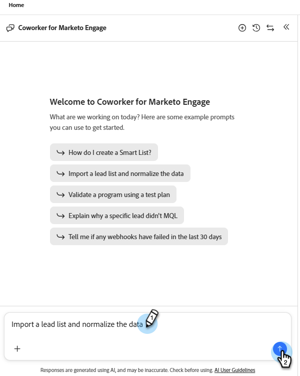

# Importer les leads {#import-leads}

Importez et dédupliquez des listes de prospects dans votre base de données Marketo Engage avec l’aide du mappage des champs.

## Utilisation {#how-to-use}

1. Dans Mon Marketo, cliquez sur la mosaïque **Collègue pour Marketo Engage**.

   

1. Saisissez « Importer une liste de prospects et normaliser les données » (ou sélectionnez-la si elle est répertoriée comme exemple d’invite) et cliquez sur l’icône de flèche vers le haut.

   

1. Vous êtes invité à charger le fichier CSV et les étapes à venir s’affichent.

   

1. Cliquez sur l’icône **+** et sélectionnez **Télécharger le fichier**. Recherchez et chargez votre fichier CSV.

   

1. Cliquez sur la flèche vers le haut.

   

1. Cliquez sur **Vérifier** pour afficher votre liste dans la console centrale.

   

1. Vérifiez les règles métier disponibles pour nettoyer votre liste. Saisissez celui que vous souhaitez et cliquez sur l’icône de flèche vers le haut.

   

   Les résultats s’affichent dans la console centrale.

   

   Si vous le souhaitez, entrez des règles métier supplémentaires.

1. Pour afficher les champs mappés, cliquez sur l’onglet **Mappages**.

1. Si des champs n’ont pas été mappés correctement, corrigez-les ici en modifiant le **champ cible**.

   

1. Une fois prêt à importer votre liste, cliquez sur l’onglet **Importer dans Marketo**.

1. Sélectionnez le dossier de destination et saisissez un nom. Cochez chaque case de consentement et cliquez sur **Démarrer l’importation**.

   

   Une fois l’importation terminée, un résumé de vérification s’affiche. Il indique les prospects traités, les lignes ayant échoué et les avertissements éventuels.
