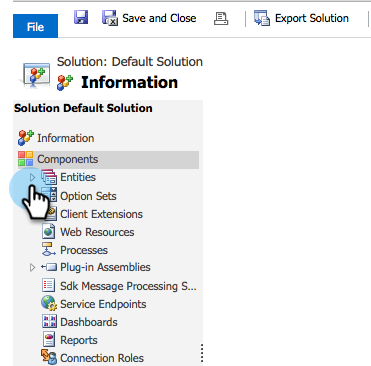

# Créer un filtre Dynamics Sync personnalisé {#create-a-custom-dynamics-sync-filter}

Vous ne souhaitez pas synchroniser tout ce qui se trouve dans votre Dynamics CRM dans Marketo ? Ne vous inquiétez pas ! Marketo vous permet de configurer un filtre de synchronisation et de synchroniser uniquement une partie de vos enregistrements.

## Présentation {#overview}

Pour configurer un filtre de synchronisation Dynamics :

1. Créez un champ personnalisé Deux options (booléen) nommé new_synctomkto dans Dynamics CRM pour tout objet (prospect, contact, compte, opportunité et autres entités personnalisées).
1. Attribuez à ce champ une valeur Oui/Non ou laissez-la vide.

>[!NOTE]
>
>Vous devez effectuer ces modifications dans Dynamics CRM, pas dans votre base de données ou votre marché.

Marketo recherche ce champ lors de la synchronisation automatique en arrière-plan et détermine les enregistrements à synchroniser en fonction de cette logique :

| Valeur du champ | Synchroniser avec le marketing ? |
|---|---|
| Le champ n&#39;existe pas | Oui |
| Le champ est vide | Oui |
| Le champ a la valeur Oui | Oui |
| Le champ a la valeur Non | Non |

>[!CAUTION]
>
>La seule façon de demander à Marketo de sauter un enregistrement consiste à définir explicitement la valeur du champ sur **Non**. Marketo synchronise toujours les enregistrements même si les valeurs de champ sont vides.

>[!NOTE]
>
>**Conditions préalables**
>
>Installez la dernière version du module externe Marketo (3.0.0.1 ou version ultérieure). Accédez à Marketo > Admin > Microsoft Dynamics > Télécharger la solution marketing.

## Créer un champ SyncToMkto {#create-synctomkto-field}

1. Connectez-vous à Dynamics CRM. Cliquez sur **Paramètres** , puis sur **Personnalisations**.

   

1. Cliquez sur **Personnaliser le système**.

   

1. Cliquez  en regard de **Entités**.

   

1. Cliquez  en regard de **Plomb **et sélectionnez **Champs**. Cliquez ensuite sur **Nouveau**.

   

1. Saisissez **SyncToMkto** dans le champ Nom **d’** affichage et sélectionnez **Deux options** comme type **de données.** Cliquez ensuite sur **Enregistrer et fermer**.

   

   >[!NOTE]
   >
   >Choisissez n’importe quel nom d’affichage pour ce champ, mais le champ Nom doit être exactement **new_synctomkto**. Vous devez utiliser **new** comme préfixe par défaut. Si vous avez modifié la valeur par défaut, allez ici pour [réinitialiser le préfixe par défaut pour les noms](create-a-custom-dynamics-sync-filter/set-a-default-custom-field-prefix.md)de champs personnalisés. Vous pouvez la modifier une fois les nouveaux champs créés.

   >[!NOTE]
   >
   >Si vous avez configuré un processus asynchrone, l&#39;enregistrement obtient la valeur SyncToMkto par défaut que vous avez définie dans le champ et obtient la valeur correcte quelques secondes plus tard lorsque le flux de travaux se termine. Si la valeur par défaut est Oui, ces enregistrements seront créés dans Marketo et deviennent obsolètes. Utilisez **Non** comme valeur par défaut pour éviter cela.

1. Répétez ce processus et créez le champ **SyncToMkto** pour toutes les autres entités sur lesquelles vous souhaitez limiter la synchronisation, telles que les entités de contact, de compte, d&#39;opportunité et personnalisées.

## Sélectionner le filtre dans le marketing {#select-the-filter-in-marketo}

Même si vous avez déjà effectué votre synchronisation initiale, entrez et sélectionnez les champs à synchroniser avec Marketo.

1. Accédez à Admin et sélectionnez **MIcrosoft Dynamics**.

   

1. Cliquez sur **Modifier** dans Détails de synchronisation des champs.

   

1. Faites défiler l’écran jusqu’au champ et cochez-le. Le nom réel doit être new_synctomkto, mais le nom d’affichage peut être n’importe quoi. Cliquez sur **Enregistrer**.

   

Parfait, vous avez maintenant activé le filtre de synchronisation pour Marketo.

## Créer un processus Dynamics pour affecter automatiquement des valeurs de filtre de synchronisation {#create-a-dynamics-workflow-to-assign-sync-filter-values-automatically}

Vous pouvez toujours affecter manuellement une valeur aux champs SyncToMkto de vos enregistrements. Mais pourquoi ne pas tirer parti de la puissance d&#39;un Workflow Dynamics et attribuer automatiquement une valeur au champ SyncToMkto lorsqu&#39;un enregistrement est créé ou mis à jour ?

>[!NOTE]
>
>Vous ne pouvez pas faire cela au niveau de la base de données. Il doit être effectué dans la gestion de la relation client manuellement ou à l’aide d’un processus.
>
>Un processus Dynamics fonctionne uniquement sur les nouveaux enregistrements créés à l&#39;avenir, et non sur les données historiques. Utilisez une mise à jour par lot pour passer d&#39;un enregistrement à un autre.

1. Accédez à Dynamics CRM. Cliquez sur **Paramètres** , puis sur **Processus**.

   

1. Cliquez sur **Nouveau**.

   

1. Saisissez un nom pour le processus, puis sélectionnez **Workflow** comme catégorie et **Piste** comme entité. Cliquez ensuite sur **OK**.

   

1. Créez des règles pour affecter une valeur true ou false au champ **SyncToMkto** en fonction des préférences de votre entreprise. Cliquez sur **Enregistrer et fermer**.

   

   >[!NOTE]
   >
   >Définissez une action par défaut après avoir cliqué sur **Ajouter l’étape** pour ajouter une condition de vérification. Cela définit les enregistrements que vous ne souhaitez pas synchroniser sur **Non**. Sinon, ils seront synchronisés.

1. Sélectionnez le processus et cliquez sur **Activer**.

   

   >[!TIP]
   >
   >Voir Règles de filtre de synchronisation [personnalisée pour une adresse](create-a-custom-dynamics-sync-filter/custom-sync-filter-rules-for-an-email-address.md) électronique afin de configurer des règles de synchronisation des enregistrements uniquement pour les personnes avec des adresses électroniques.

## Détails du filtre de synchronisation {#sync-filter-details}

Voici quelques détails d’implémentation que nous avons pensé devoir connaître :

1. Début d’une opération de synchronisation

   Lorsque la valeur **SyncToMkto** passe de **Non** à **Oui**, Dynamics avertit immédiatement Marketo du début de la synchronisation de cet enregistrement. Si l’enregistrement existe déjà, Marketo le met à jour. Sinon, Marketo crée l’enregistrement.

   >[!TIP]
   >
   >Une opération **Create [StartSync]** est ajoutée au journal marketing lorsque cela se produit.

1. Arrêt d’une opération de synchronisation

   Lorsqu’un enregistrement change sa valeur SyncToMkto de Oui à Non, Marketo est averti de l’arrêt de la synchronisation de cet enregistrement. Cependant, l&#39;enregistrement n&#39;est pas supprimé, mais il cesse d&#39;obtenir des mises à jour et devient obsolète.

>[!NOTE]
>
>**Articles connexes**
>
>* [Filtre Microsoft Dynamics Sync : Qualifier](create-a-custom-dynamics-sync-filter/microsoft-dynamics-sync-filter-qualify.md)
>* [Filtre Microsoft Dynamics Sync : Fusionner](create-a-custom-dynamics-sync-filter/microsoft-dynamics-sync-filter-merge.md)
>* [Règles de filtre de synchronisation personnalisée pour une adresse électronique](create-a-custom-dynamics-sync-filter/custom-sync-filter-rules-for-an-email-address.md)

>

