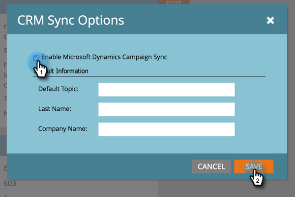

# Activer la synchronisation de la campagne {#enable-campaign-sync}

Cette option permet à Marketo d’ajouter et de supprimer des membres d’[!DNL MS Dynamics] Campaign.

>[!PREREQUISITES]
>
>Effectuez la mise à jour vers la dernière version du plug-in [!DNL Dynamics] pour Marketo.

>[!NOTE]
>
>**Autorisations d’administrateur requises**

1. Dans votre **[!UICONTROL Mon Marketo]**, cliquez sur **[!UICONTROL Admin]**.

   

1. Cliquez sur **[!UICONTROL Microsoft Dynamics]**.

   

1. Sous **[!UICONTROL Options de synchronisation]**, cliquez sur **[!UICONTROL Modifier]**.

   

1. Cochez la case **[!UICONTROL Activer la synchronisation de la campagne Microsoft Dynamics]** puis cliquez sur **[!UICONTROL Enregistrer]**.

   

Voilà, c&#39;est fait. Il vous suffit de laisser le temps à la synchronisation d’extraire les données de [!DNL Microsoft Dynamics] et tout est prêt.

>[!NOTE]
>
>La réinitialisation de la case à cocher [!DNL Dynamics] la synchronisation de la campagne actualisera toutes les données de campagne précédemment synchronisées et les associations avec les listes marketing dans [!DNL Dynamics].
