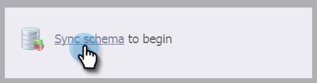

# Activation de la synchronisation pour une entité personnalisée {#enable-sync-for-a-custom-entity}

Si vous avez besoin que les données d’entité personnalisées de Dynamics soient disponibles dans Marketo Engage, voici comment activer la synchronisation pour celle-ci.

>[!NOTE]
>
>**Autorisations d’administrateur requises**

>[!NOTE]
>
>* Lorsque vous activez la synchronisation pour une entité personnalisée, Marketo effectue une synchronisation initiale afin d’importer toutes les données de l’objet personnalisé.
>* Les membres de liste marketing et de liste marketing sont _non pris en charge_ à ce moment-là.

>[!IMPORTANT]
>
>L’utilisateur de synchronisation Marketo doit disposer d’un accès en lecture à l’objet personnalisé pour le répertorier et y effectuer une synchronisation.

1. Accédez au **[!UICONTROL Administration]** .

   

1. Sélectionner **[!UICONTROL Microsoft Dynamics]** et cliquez sur **[!UICONTROL Désactiver la synchronisation]**.

   

   >[!NOTE]
   >
   >Vous devez désactiver temporairement la synchronisation globale pour activer ou désactiver une entité personnalisée.

1. Sous Database Management, cliquez sur **[!UICONTROL Synchronisation des entités Dynamics]**.

   

1. Cliquez sur **[!UICONTROL Schéma de synchronisation]**.

   

1. Sélectionnez l’entité à synchroniser, puis cliquez sur **[!UICONTROL Activer la synchronisation]**.

   

1. Sélectionnez les champs que vous souhaitez synchroniser ou utiliser comme [contraintes](/help/marketo/product-docs/core-marketo-concepts/smart-lists-and-static-lists/using-smart-lists/add-a-constraint-to-a-smart-list-filter.md) et/ou déclencheurs (pour les enregistrements ajoutés, _not_ mise à jour) dans les listes dynamiques. Lorsque vous avez terminé, cliquez sur **[!UICONTROL Activer la synchronisation]**.

   

   >[!NOTE]
   >
   >Au cours du processus de synchronisation, vous pouvez remarquer que la variable[!UICONTROL Synchronisation des entités dynamiques]&quot; disparaît de l’arborescence de navigation. Ce comportement est attendu et réapparaîtra une fois la synchronisation terminée.

1. L’entité dispose désormais d’une coche verte.

   

1. N’oubliez pas de réactiver la synchronisation globale !

   
