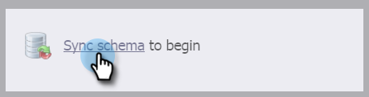

# Microsoft Dynamics Sync : Synchronisation d&#39;entité personnalisée {#microsoft-dynamics-sync-custom-entity-sync}

Si vous devez activer la synchronisation d&#39;entité personnalisée initiale pour rendre les données de Dynamics disponibles dans Marketing, voici comment procéder.

>[!NOTE]
>
>**Autorisations d’administrateur requises**

>[!PREREQUISITES]
>
>Pour utiliser un objet personnalisé, il doit être associé à un objet [prospect](/help/marketo/product-docs/crm-sync/microsoft-dynamics-sync/microsoft-dynamics-sync-details/microsoft-dynamics-sync-lead-sync.md), [contact](/help/marketo/product-docs/crm-sync/microsoft-dynamics-sync/microsoft-dynamics-sync-details/microsoft-dynamics-sync-contact-sync.md) ou [compte](/help/marketo/product-docs/crm-sync/microsoft-dynamics-sync/microsoft-dynamics-sync-details/microsoft-dynamics-sync-account-sync.md)dans Dynamics.

>[!CAUTION]
>
>Assurez-vous que la synchronisation initiale est terminée (vous en serez averti par courrier électronique) avant de commencer la synchronisation pour les entités personnalisées.

1. Accédez à la section Admin.

   

1. Cliquez sur **Désactiver la synchronisation** pour désactiver temporairement la synchronisation globale standard.

   

1. Installez une version de Microsoft Dynamics qui prend en charge la synchronisation d&#39;entité personnalisée (après 2_0_0_2). Voir [Versions du module externe Marketo pour MIcrosoft Dynamics](/help/marketo/product-docs/crm-sync/microsoft-dynamics-sync/marketo-plugin-releases-for-microsoft-dynamics.md).

1. Donnez à l’utilisateur de synchronisation marketing l’accès en lecture à toutes les entités que vous prévoyez de synchroniser.

1. Sous Gestion de la base de données, cliquez sur le lien **Dynamics Entities Sync**.

   

1. Cliquez sur le lien **schéma de synchronisation** pour rétablir la liste des entités personnalisées disponibles.

   

1. Une fois la liste synchronisée, sélectionnez les champs à synchroniser et ceux à utiliser comme [contraintes](/help/marketo/product-docs/core-marketo-concepts/smart-lists-and-static-lists/using-smart-lists/add-a-constraint-to-a-smart-list-filter.md) et/ou déclencheurs dans les listes dynamiques. Lorsque vous avez terminé, cliquez sur **Activer la synchronisation**.

   

1. Réactivez la synchronisation globale.

   

   >[!NOTE]
   >
   >Marketo ne prend en charge que les entités personnalisées liées à des entités standard d’un ou deux niveaux.

   >[!NOTE]
   >
   >Les noms d’entité peuvent comporter au maximum **33 caractères**.

Tu es bon !
