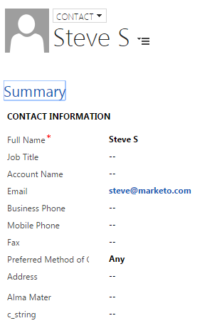

# Créer un contact dans [!DNL Microsoft Dynamics] {#create-a-contact-in-microsoft-dynamics}

1. Sélectionnez la personne en mode Marketo Engage uniquement (le type de Microsoft est vide) que vous souhaitez créer en tant que contact dans Dynamics.

   

1. Cliquez sur **[!UICONTROL Actions de personne]** et **[!DNL Microsoft]**, puis sélectionnez **[!UICONTROL Synchroniser la personne avec Microsoft]**.

   

1. Cliquez sur **[!UICONTROL Synchroniser avec]** et sélectionnez **[!UICONTROL Contact]**. Cliquez sur **[!UICONTROL Exécuter maintenant]**.

   

   >[!NOTE]
   >
   >Lors de l’utilisation de l’action de flux « [!UICONTROL Synchroniser la personne avec Microsoft] » (dans une campagne Trigger uniquement), le prospect/contact est créé en temps réel dans Dynamics.

1. Marketo qualifie cet enregistrement de lead dans [!DNL Dynamics] en contact qui n’est associé à aucun compte dans [!DNL Dynamics].

   

1. Vous pouvez désormais sélectionner **[!UICONTROL Contact]** lorsque vous utilisez la contrainte Synchroniser en tant que dans un filtre de campagne dynamique.

   
