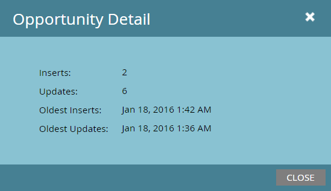

# Statut de synchronisation {#sync-status}

Vous pouvez conserver des onglets sur le débit actuel et la liste d’attente du processus de synchronisation sur les onglets [!UICONTROL Statut de la synchronisation] et [!UICONTROL Erreurs de synchronisation].

## [!UICONTROL Statut de synchronisation] Onglet {#sync-status-tab}

1. Cliquez sur **[!UICONTROL Admin]** et **[!UICONTROL Microsoft Dynamics]**.

   

1. Cliquez sur l’onglet **[!UICONTROL Statut de la synchronisation]**.

   

   Ce tableau affiche la liste d&#39;attente des insertions et mises à jour qui n&#39;ont pas encore été synchronisées, pour chaque objet.

1. Double-cliquez sur une ligne pour afficher les informations sur l’opportunité.

   

   Les détails du statut de synchronisation sont répartis par insertions et mises à jour, et les enregistrements d&#39;insertion et de mise à jour les plus anciens.

   

1. Cliquez sur le menu déroulant **[!UICONTROL Affichage]** et sélectionnez **[!UICONTROL Dernière heure]** pour afficher les informations sur le débit.

   

   L’affichage affiche désormais le nombre d’enregistrements synchronisés au cours de la dernière heure complète (par exemple, 13 h 00 à 14 h 00).

   

   >[!NOTE]
   >
   >Lorsque vous consultez la vue [!UICONTROL Dernière heure], les colonnes [!UICONTROL Insertions] et [!UICONTROL Mises à jour] s’affichent sans objet. Il s’agit d’un comportement attendu.

## [!UICONTROL Erreurs de synchronisation] Onglet {#sync-errors-tab}

Parcourez, recherchez ou exportez des prospects (et d’autres objets) dont la synchronisation a échoué avec des détails tels que l’opération, le sens, le code d’erreur et le message d’erreur.

>[!MORELIKETHIS]
>
>[Types de notification](/help/marketo/product-docs/core-marketo-concepts/miscellaneous/understanding-notifications/notification-types.md){target="_blank"}
