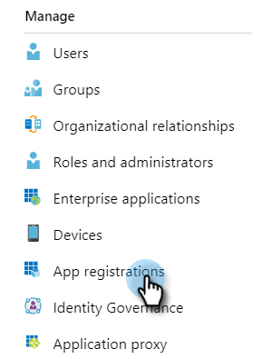

# Enregistrer une application avec Azure pour acquérir votre ID client/ID d&#39;application {#register-an-app-with-azure-to-acquire-your-client-id-app-id}

Azure Principale Directory étend vos répertoires locaux dans le cloud, fournissant la prise en charge de MS Dynamics 365 CRM avec authentification ADFS sur site.

## Enregistrement d’une nouvelle application {#registering-a-new-app}

1. [Connectez-vous](http://manage.windowsazure.com/) au portail de gestion Microsoft Azure à l&#39;aide d&#39;un compte doté d&#39;autorisations d&#39;administrateur. Vous pouvez également accéder au portail Microsoft Azure via le Centre d&#39;administration Office 365 en développant l&#39;élément **Admin** dans le volet de navigation de gauche et en sélectionnant **Azure AD**.

   >[!CAUTION]
   >
   >Vous devez utiliser un compte dans le même abonnement Office 365 que celui avec lequel vous souhaitez enregistrer l’application.

   >[!NOTE]
   >
   >Si vous n&#39;avez pas de compte Azure, vous pouvez vous [inscrire](https://azure.microsoft.com/en-us/free/) pour un compte Azure. Consultez la documentation de Microsoft ou contactez votre représentant Microsoft pour plus d&#39;informations. Une fois que vous avez créé un compte Azure, vous pouvez enregistrer une ou plusieurs applications en suivant la procédure décrite ci-dessous.
   >
   >
   >Si vous avez un compte Azure mais que votre abonnement Office 365 avec Microsoft Dynamics 365 n&#39;est pas disponible dans votre abonnement Azure, suivez [ces instructions](https://msdn.microsoft.com/office/office365/howto/setup-development-environment#bk_CreateAzureSubscription) pour associer les deux comptes.

1. Recherchez et cliquez sur **Azure Principal Directory** dans le volet de navigation de gauche.

   

1. Sous Gérer, cliquez sur Inscriptions **** d’application.

   

1. Cliquez sur **Nouvel enregistrement **en haut de la page.

   

1. Saisissez un nom pour votre application, choisissez le type de compte approprié, puis saisissez une URL de redirection. Cliquez ensuite sur **S’inscrire** au bas de la page.

   

1. Vous devriez maintenant voir votre application dans l’onglet Inscriptions **de l’** application.

   

## Configuration des autorisations d’application {#configuring-app-permissions}

1. Sous l&#39;onglet Inscriptions **de l&#39;** application dans votre Principale Directory, cliquez sur l&#39;application pour laquelle vous souhaitez configurer les autorisations.

   

1. Sous Gérer, cliquez sur Autorisations **** API.

   

1. Cliquez sur le bouton **Ajouter une autorisation** .

   

1. Sélectionnez **Dynamics CRM**.

   

1. Cochez la case **Accéder au service de données commun en tant qu’utilisateur de l’organisation***s** , puis cliquez sur **Ajouter les autorisations.**

   

1. Une fois les autorisations ajoutées, patientez au moins 10 secondes.

   

1. Cliquez sur le bouton **Accorder le consentement** de l’administrateur.

   

1. Cliquez sur **Oui** pour confirmer.

   

   Et vous avez fini !

   

