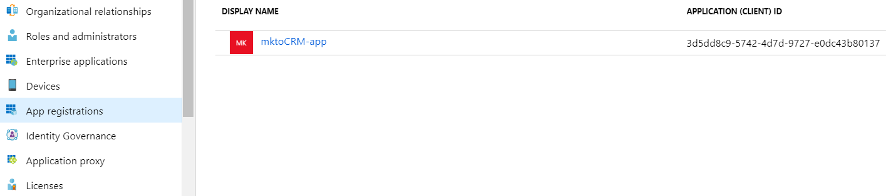
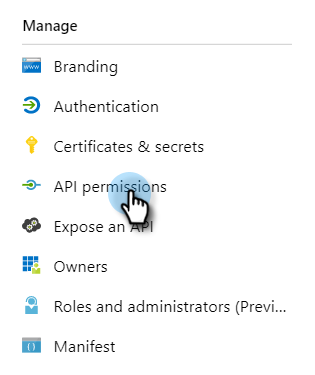
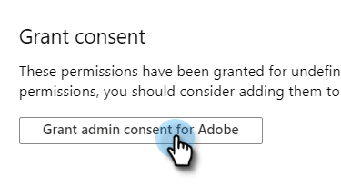
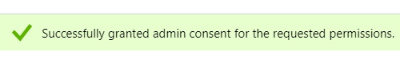

# Enregistrez une application sur Azure pour obtenir votre identifiant client ou identifiant d’application {#register-an-app-with-azure-to-acquire-your-client-id-app-id}

Azure Active Directory étend vos répertoires locaux dans le cloud, fournissant ainsi la prise en charge de [!DNL MS Dynamics 365] CRM avec authentification ADFS on-premise.

## Enregistrement d’une nouvelle application {#registering-a-new-app}

1. [ Connectez-vous ](https://login.microsoftonline.com/){target="_blank"} portail de gestion Microsoft Azure à l’aide d’un compte disposant d’autorisations d’administrateur. Vous pouvez également accéder au portail Microsoft Azure via le Centre d’administration Office 365 en développant l’élément **[!UICONTROL Admin]** dans le volet de navigation de gauche et en sélectionnant **[!UICONTROL Azure AD]**.

   >[!CAUTION]
   >
   >Vous devez utiliser un compte dans le même abonnement [!DNL Office 365] que celui avec lequel vous avez l’intention d’enregistrer l’application.

   >[!NOTE]
   >
   >Si vous ne disposez pas d’un compte Azure, vous pouvez vous [inscrire](https://azure.microsoft.com/en-us/free/){target="_blank"} pour l’un d’eux. Reportez-vous à la documentation de Microsoft ou contactez votre représentant Microsoft pour plus d’informations. Une fois que vous avez créé un compte Azure, vous pouvez enregistrer une ou plusieurs applications en suivant la procédure décrite ci-dessous.
   >
   >
   >Si vous disposez d’un compte Azure mais que votre abonnement [!DNL Office 365] avec [!DNL Microsoft Dynamics 365] n’est pas disponible dans votre abonnement Azure, suivez [ces instructions](https://msdn.microsoft.com/office/office365/howto/setup-development-environment#bk_CreateAzureSubscription){target="_blank"} pour associer les deux comptes.

1. Recherchez **[!UICONTROL Azure Active Directory]** et cliquez dessus dans le volet de navigation de gauche.

   

1. Sous [!UICONTROL Gérer], cliquez sur **[!UICONTROL Enregistrement des applications]**.

   

1. Cliquez sur **[!UICONTROL Nouvel enregistrement]** en haut de la page.

   

1. Saisissez un nom pour votre application, choisissez votre type de compte applicable et saisissez une URL de redirection. Cliquez ensuite sur **[!UICONTROL Enregistrer]** au bas de la page.

   

1. Votre application doit maintenant apparaître dans l’onglet **[!UICONTROL Enregistrements des applications]**.

   

## Configuration des autorisations d’application {#configuring-app-permissions}

1. Sous l’onglet **[!UICONTROL Enregistrements des applications]** dans votre Active Directory, cliquez sur l’application pour laquelle vous souhaitez configurer des autorisations.

   

1. Sous [!UICONTROL Gérer], cliquez sur **[!UICONTROL Autorisations d’API]**.

   

1. Cliquez sur le bouton **[!UICONTROL Ajouter une autorisation]**.

   

1. Choisissez **[!UICONTROL Dynamics CRM]**.

   

1. Cochez la case **[!UICONTROL Accéder au service commun de données en tant qu’utilisateurs de l’organisation]** puis cliquez sur **[!UICONTROL Ajouter des autorisations].**

   

1. Une fois les autorisations ajoutées, patientez au moins 10 secondes.

   

1. Cliquez sur le bouton **[!UICONTROL Accorder le consentement administrateur]**.

   

1. Cliquez sur **[!UICONTROL Oui]** pour confirmer.

   

   Et c&#39;est fini !

   
