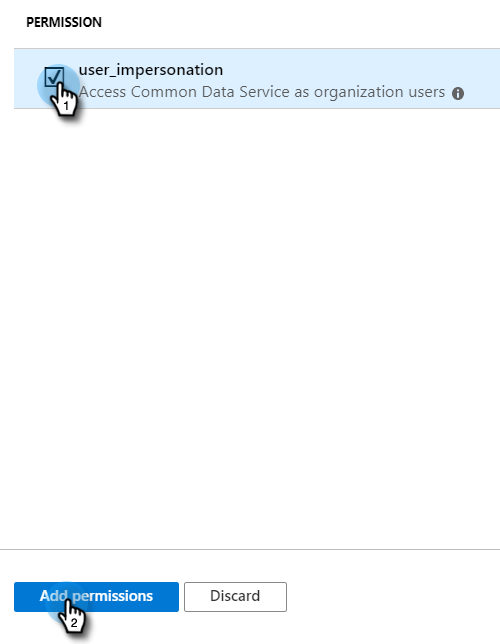

# Enregistrer une application avec Azure pour acquérir votre ID client/ID d’application {#register-an-app-with-azure-to-acquire-your-client-id-app-id}

Azure Active Directory étend vos répertoires sur site dans le cloud, fournissant ainsi une prise en charge du CRM MS Dynamics 365 avec authentification ADFS on-premise.

## Enregistrement d’une nouvelle application {#registering-a-new-app}

1. [Connexion](https://login.microsoftonline.com/){target="_blank"} sur le portail de gestion Microsoft Azure à l’aide d’un compte avec des autorisations d’administrateur. Vous pouvez également accéder au portail Microsoft Azure à l’aide du Centre d’administration Office 365 en développant le **[!UICONTROL Administration]** dans le volet de navigation de gauche et en sélectionnant **[!UICONTROL Azure AD]**.

   >[!CAUTION]
   >
   >Vous devez utiliser un compte dans le même abonnement Office 365 que celui avec lequel vous envisagez d’enregistrer l’application.

   >[!NOTE]
   >
   >Si vous ne disposez pas d’un compte Azure, vous pouvez [inscription](https://azure.microsoft.com/en-us/free/){target="_blank"} pour une. Pour plus d’informations, reportez-vous à la documentation Microsoft ou contactez votre représentant Microsoft. Une fois que vous avez créé un compte Azure, vous pouvez enregistrer une ou plusieurs applications en suivant la procédure décrite ci-dessous.
   >
   >
   >Si vous disposez d’un compte Azure mais que votre abonnement Office 365 avec Microsoft Dynamics 365 n’est pas disponible dans votre abonnement Azure, suivez [ces instructions](https://msdn.microsoft.com/office/office365/howto/setup-development-environment#bk_CreateAzureSubscription){target="_blank"} pour associer les deux comptes.

1. Rechercher et cliquer sur **[!UICONTROL Azure Active Directory]** dans le volet de navigation de gauche.

   

1. Sous Gérer, cliquez sur **[!UICONTROL Inscriptions des applications]**.

   

1. Cliquez sur **[!UICONTROL Nouvelle inscription]** en haut de la page.

   

1. Saisissez un nom pour votre application, sélectionnez le type de compte approprié, puis saisissez une URL de redirection. Cliquez ensuite sur **[!UICONTROL Enregistrer]** au bas de la page.

   

1. Votre application devrait maintenant apparaître dans la **[!UICONTROL Inscriptions des applications]** .

   

## Configuration des autorisations d’application {#configuring-app-permissions}

1. Sous , **[!UICONTROL Inscriptions des applications]** dans votre Active Directory, cliquez sur l’application pour laquelle vous souhaitez configurer des autorisations.

   

1. Sous Gérer, cliquez sur **[!UICONTROL Autorisations d’API]**.

   

1. Cliquez sur le bouton **[!UICONTROL Ajouter une autorisation]** bouton .

   

1. Choisir **[!UICONTROL Dynamics CRM]**.

   

1. Vérifiez les **[!UICONTROL Accès à Common Data Service en tant qu’utilisateurs de l’organisation]** , puis cliquez sur **[!UICONTROL Ajout d’autorisations]**.

   

1. Une fois les autorisations ajoutées, patientez au moins 10 secondes.

   

1. Cliquez sur le bouton **[!UICONTROL Autorisation du consentement de l’administrateur]** bouton .

   

1. Cliquez sur **[!UICONTROL Oui]** pour confirmer.

   

   Et vous avez fini !

   
