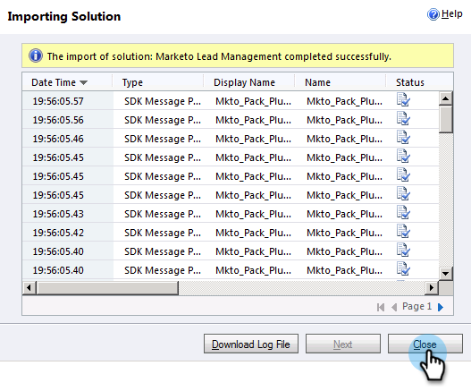

# Étape 1 sur 3 : installation de la solution Marketo (2011 sur site) {#step-of-install-the-marketo-solution-on-premises}

Avant de pouvoir synchroniser Microsoft Dynamics On-Premise et Marketo Engage, vous devez installer la solution Marketo dans Dynamics.

>[!NOTE]
>
>Une fois que vous avez synchronisé Marketo avec un CRM, vous ne pouvez pas effectuer une nouvelle synchronisation sans remplacer l’instance.

>[!PREREQUISITES]
>
>Vous devez avoir [Déploiement Internet Face](https://www.microsoft.com/en-us/download/confirmation.aspx?id=41701){target="_blank"} (IFD) avec [ Active Directory Federation Services](https://msdn.microsoft.com/en-us/library/bb897402.aspx){target="_blank"} 2.0, 2.1 ou 3.0 (ADFS) configuré. **Remarque** : le document IFD se télécharge automatiquement lorsque vous cliquez sur le lien.
>
>[Téléchargez la solution de gestion des pistes Marketo](/help/marketo/product-docs/crm-sync/microsoft-dynamics-sync/sync-setup/download-the-marketo-lead-management-solution.md){target="_blank"} avant de commencer.

>[!NOTE]
>
>**Autorisations d’administrateur Dynamics requises**.
>
>Pour effectuer cette synchronisation, vous avez besoin des privilèges d’administrateur CRM.

1. Connectez-vous à Dynamics et sélectionnez **[!UICONTROL Paramètres]** dans le menu inférieur gauche.

   

1. Sélectionnez **[!UICONTROL Solutions]** dans l’arborescence.

   

1. Cliquez sur **[!UICONTROL Importer]**.

   

1. Cliquez sur **[!UICONTROL Parcourir]**. Sélectionnez la solution Marketo Lead Management que vous avez [ téléchargée ](/help/marketo/product-docs/crm-sync/microsoft-dynamics-sync/sync-setup/download-the-marketo-lead-management-solution.md){target="_blank"}. Cliquez sur **[!UICONTROL Suivant]**.

   

1. Affichez les informations sur la solution et cliquez sur **[!UICONTROL Afficher les détails du package de solution]**.

   

1. Lorsque vous avez terminé de vérifier tous les détails, cliquez sur **[!UICONTROL Fermer]**.

   

1. De retour sur la page Informations sur la solution, cliquez sur **[!UICONTROL Suivant]**.

   

1. Assurez-vous que la case Option de message du SDK est cochée. Cliquez sur **[!UICONTROL Suivant]**.

   

   >[!TIP]
   >
   >Vous devez activer les fenêtres contextuelles de votre navigateur pour terminer le processus d’installation.

1. Maintenant, attendez la fin de l’importation. Lève-toi et fais des étirements.

   

1. Cliquez sur **[!UICONTROL Fermer]**.

   >[!NOTE]
   >
   >Un message peut s’afficher indiquant &quot;Gestion des pistes Marketo terminée avec un avertissement&quot;. Cela est tout à fait attendu.

   

1. La gestion des pistes Marketo apparaît désormais sur la page **Toutes les solutions**.

   

1. Sélectionnez Gestion des pistes Marketo et cliquez sur **[!UICONTROL Publish All Customizations]**.

   

>[!CAUTION]
>
>La désactivation de l’un des processus de messagerie du SDK Marketo entraînera une mauvaise installation.

>[!MORELIKETHIS]
>
>[Étape 2 sur 3 : configuration de l’utilisateur de synchronisation Marketo dans Dynamics (2011 On-Premise)](/help/marketo/product-docs/crm-sync/microsoft-dynamics-sync/sync-setup/connecting-to-legacy-versions/step-2-of-3-set-up-2011.md){target="_blank"}
