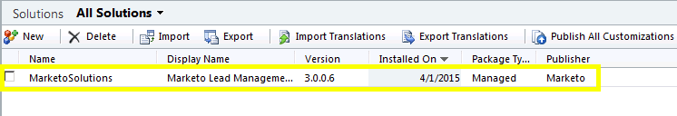
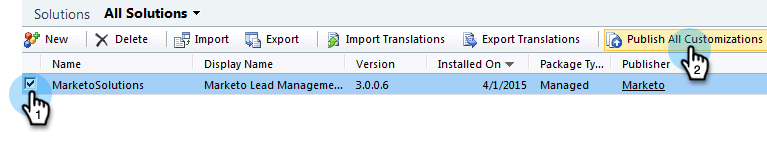

# Étape 1 sur 3 : installation de la solution Marketo (2011 On-Premise) {#step-of-install-the-marketo-solution-on-premises}

Avant de pouvoir synchroniser [!DNL Microsoft Dynamics] On-Premise et Marketo, vous devez d’abord installer la solution Marketo dans [!DNL Dynamics].

>[!NOTE]
>
>Après avoir synchronisé Marketo avec un CRM, vous ne pouvez pas effectuer de nouvelle synchronisation sans remplacer l’instance .

>[!PREREQUISITES]
>
>Vous devez avoir configuré [Internet Facing Deployment](https://learn.microsoft.com/en-us/dynamics365/customerengagement/on-premises/deploy/configure-an-internet-facing-deployment){target="_blank"} (IFD) avec [Active Directory Federation Services](https://msdn.microsoft.com/en-us/library/bb897402.aspx){target="_blank"} 2.0, 2.1 ou 3.0 (ADFS). **Remarque** : le document IFD est téléchargé automatiquement lorsque vous cliquez sur le lien.
>
>[Téléchargez la solution de gestion des prospects de Marketo](/help/marketo/product-docs/crm-sync/microsoft-dynamics-sync/sync-setup/download-the-marketo-lead-management-solution.md){target="_blank"} avant de commencer.

>[!NOTE]
>
>Autorisations d’administrateur **[!DNL Dynamics]requises.**
>
>Vous avez besoin de privilèges d’administrateur CRM pour effectuer cette synchronisation.

1. Connectez-vous à **[!DNL Dynamics]**, puis sélectionnez **[!UICONTROL Paramètres]** dans le menu inférieur gauche.

   

1. Sélectionnez **[!UICONTROL Solutions]** dans l’arborescence.

   

1. Cliquez sur **[!UICONTROL Importer]**.

   

1. Cliquez sur **[!UICONTROL Parcourir]**. Sélectionnez la solution Marketo Lead Management que vous [téléchargé](/help/marketo/product-docs/crm-sync/microsoft-dynamics-sync/sync-setup/download-the-marketo-lead-management-solution.md). Cliquez sur **[!UICONTROL Suivant]**.

   

1. Affichez les informations sur la solution et cliquez sur **[!UICONTROL Afficher les détails du package de solution]**.

   

1. Une fois la vérification de tous les détails terminée, cliquez sur **[!UICONTROL Fermer]**.

   

1. De retour sur la page Informations sur la solution, cliquez sur **[!UICONTROL Suivant]**.

   

1. Assurez-vous que la case à cocher de l’option Message SDK est activée. Cliquez sur **[!UICONTROL Suivant]**.

   

   >[!TIP]
   >
   >Vous devez activer les fenêtres contextuelles sur votre navigateur pour terminer le processus d’installation.

1. Attendez maintenant la fin de l’importation. Lève-toi et fais des étirements.

   

1. Cliquez sur **[!UICONTROL Fermer]**.

   >[!NOTE]
   >
   >Il se peut qu’un message indiquant « Marketo Lead Management terminé avec un avertissement » s’affiche. Cela est tout à fait prévu.

   

1. [!UICONTROL Gestion des prospects Marketo] apparaît désormais sur la page **[!UICONTROL Toutes les solutions]**.

   

1. Sélectionnez [!UICONTROL Marketo Lead Management] puis cliquez sur **[!UICONTROL Publier toutes les personnalisations]**.

   

>[!CAUTION]
>
>La désactivation de l’un des processus de messagerie SDK de Marketo entraînera une installation interrompue.

>[!MORELIKETHIS]
>
>[Étape 2 de 3 : configurer l’utilisateur de synchronisation Marketo dans  [!DNL Dynamics] (2011 On-Premise)](/help/marketo/product-docs/crm-sync/microsoft-dynamics-sync/sync-setup/connecting-to-legacy-versions/step-2-of-3-set-up-2011.md)
