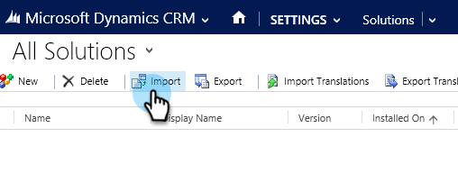
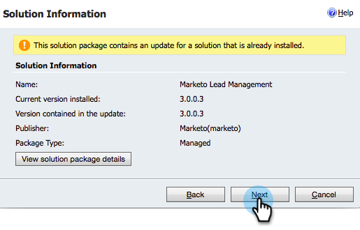

# Étape 1 sur 3 : Configurer l’utilisateur de synchronisation pour Marketo (On-Prem 2015) {#step-of-configure-sync-user-for-marketo-on-premises-2015}

Avant de pouvoir synchroniser Microsoft Dynamics 2015 On-Premise avec Marketo Engage, vous devez d&#39;abord installer la solution Marketo dans Dynamics.

>[!NOTE]
>
>Après avoir synchronisé Marketo avec un CRM, vous ne pouvez pas synchroniser un nouveau CRM avec l’instance Marketo existante.

>[!PREREQUISITES]
>
>Si vous utilisez Microsoft Dynamics On-Premise, vous devez avoir configuré [Déploiement par Internet](https://learn.microsoft.com/en-us/dynamics365/customerengagement/on-premises/deploy/configure-an-internet-facing-deployment){target="_blank"} (IFD) avec [Services de fédération Active Directory](https://msdn.microsoft.com/en-us/library/bb897402.aspx){target="_blank"} 2.0+ (ADFS). Remarque : le document IFD est téléchargé automatiquement lorsque vous cliquez sur le lien.
>
>[Téléchargez la solution de gestion des prospects de Marketo](/help/marketo/product-docs/crm-sync/microsoft-dynamics-sync/sync-setup/download-the-marketo-lead-management-solution.md){target="_blank"} avant de commencer.

>[!NOTE]
>
>**Autorisations d’administrateur Dynamics requises**.
>
>Vous avez besoin de privilèges d’administrateur CRM pour effectuer cette synchronisation.

1. Connectez-vous à Dynamics. Cliquez sur le menu déroulant **[!UICONTROL Microsoft Dynamics CRM]** et sélectionnez **[!UICONTROL Paramètres]**.

   

1. Sous **[!UICONTROL Paramètres]**, sélectionnez **[!UICONTROL Solutions]**.

   

1. Cliquez sur **[!UICONTROL Importer]**.

   

1. Cliquez sur **[!UICONTROL Parcourir]** et sélectionnez la solution que vous [téléchargée](/help/marketo/product-docs/crm-sync/microsoft-dynamics-sync/sync-setup/download-the-marketo-lead-management-solution.md). Cliquez sur **[!UICONTROL Suivant]**.

   

1. Affichez les informations sur la solution et cliquez sur **[!UICONTROL Afficher les détails du package de solution]**.

   

1. Une fois la vérification de tous les détails terminée, cliquez sur **[!UICONTROL Fermer]**.

   

1. De retour sur la page Informations sur la solution, cliquez sur **[!UICONTROL Suivant]**.

   

1. Assurez-vous que la case option SDK est cochée. Cliquez sur **[!UICONTROL Importer]**.

   

1. Attendez la fin de l’importation.

   >[!TIP]
   >
   >Vous devez activer les fenêtres contextuelles sur votre navigateur pour terminer le processus d’installation.

   

1. Téléchargez un fichier journal (si vous le souhaitez) et cliquez sur **[!UICONTROL Fermer]**.

   >[!NOTE]
   >
   >Il se peut qu’un message indiquant « Marketo Lead Management terminé avec un avertissement » s’affiche. Cela est tout à fait prévu.

   

1. La gestion des prospects Marketo apparaît désormais sur la page **[!UICONTROL Toutes les solutions]**.

   

1. Sélectionnez la solution Marketo et cliquez sur **[!UICONTROL Publier toutes les personnalisations]**.

   

   Beau travail ! L&#39;installation est terminée.

   >[!CAUTION]
   >
   >La désactivation de l’un des processus de messagerie SDK de Marketo entraînera une installation interrompue.

   >[!MORELIKETHIS]
   >
   >[Installation de Marketo pour Microsoft Dynamics 2015 On-Premise Étape 2 sur 3](/help/marketo/product-docs/crm-sync/microsoft-dynamics-sync/sync-setup/connecting-to-legacy-versions/step-2-of-3-set-up-2015.md){target="_blank"}
