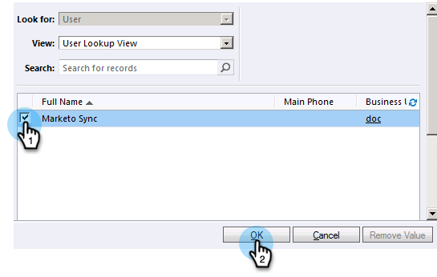

# Étape 2 sur 3 : Configuration de l’utilisateur de synchronisation Marketo dans Dynamics (2011 On-Premise) {#step-of-set-up-marketo-sync-user-in-dynamics-on-premises}

Excellent travail en suivant les étapes précédentes, continuons à le faire.

>[!PREREQUISITES]
>
>[Étape 1 sur 3 : Installation de la solution Marketo (2011 On-Premise)](/help/marketo/product-docs/crm-sync/microsoft-dynamics-sync/sync-setup/connecting-to-legacy-versions/step-1-of-3-install-2011.md)

## Attribution d’un rôle d’utilisateur de synchronisation {#assign-sync-user-role}

Attribuez le rôle Utilisateur de synchronisation Marketo uniquement à l’utilisateur de synchronisation Marketo. Vous n’avez pas besoin de l’affecter à d’autres utilisateurs.

>[!NOTE]
>
>Cela s’applique au module externe Marketo version 4.0.0.14 et ultérieure. Pour les versions antérieures, tous les utilisateurs doivent disposer du rôle d’utilisateur de synchronisation. Pour mettre à niveau Marketo, voir [Mise à niveau de la solution Marketo pour Microsoft Dynamics](/help/marketo/product-docs/crm-sync/microsoft-dynamics-sync/sync-setup/update-the-marketo-solution-for-microsoft-dynamics.md).

>[!IMPORTANT]
>
>Paramètre de langue de l’utilisateur de synchronisation [doit être défini sur Anglais.](https://portal.dynamics365support.com/knowledgebase/article/KA-01201/en-us).

1. Dans le menu inférieur gauche, sélectionnez **Paramètres**.

   

1. Dans l’arborescence, sélectionnez **Administration**.

   

1. Sélectionner **Utilisateurs**.

   

1. Vous trouverez ici une liste des utilisateurs. Sélectionnez votre utilisateur de synchronisation Marketo dédié ou contactez votre [Principale Directory Federation Services (AFDS)](https://msdn.microsoft.com/en-us/library/bb897402.aspx) pour créer un utilisateur dédié à Marketo. Cliquez sur **Gestion des rôles**.

   

1. Vérifier **Utilisateur de synchronisation Marketo** et cliquez sur **OK**.

   

   >[!TIP]
   >
   >Si vous ne voyez pas le rôle, revenez à [étape 1 sur 3](/help/marketo/product-docs/crm-sync/microsoft-dynamics-sync/sync-setup/connecting-to-legacy-versions/step-1-of-3-install-2011.md) et importez la solution.

   >[!NOTE]
   >
   >Toutes les mises à jour effectuées dans votre CRM par l’utilisateur de synchronisation **not** être synchronisé à nouveau avec Marketo.

## Configuration de la solution Marketo {#configure-marketo-solution}

Presque fini ! Nous n&#39;avons que quelques derniers éléments de configuration avant de passer à l&#39;article suivant.

1. Sélectionner **Paramètres**. Sélectionnez **Configuration Marketo** dans l&#39;arbre.

   

   >[!NOTE]
   >
   >Si la configuration Marketo est manquante, essayez d’actualiser la page. Si le problème persiste, [publier de nouveau la solution Marketo ;](/help/marketo/product-docs/crm-sync/microsoft-dynamics-sync/sync-setup/connecting-to-legacy-versions/step-1-of-3-install-2011.md) ou déconnectez-vous et reconnectez-vous.

1. Cliquez sur **Par défaut**.

   

1. Cliquez sur 

   

1. Dans la fenêtre contextuelle, sélectionnez l’utilisateur de synchronisation. Cliquez ensuite sur **OK**.

   

1. Cliquez sur **Enregistrer** pour enregistrer les modifications.

   

1. Cliquez sur **Publier toutes les personnalisations**.

   

## Avant de passer à l’étape 3 {#before-proceeding-to-step}

    * Si vous souhaitez limiter le nombre d’enregistrements que vous synchronisez, [configurez un filtre de synchronisation personnalisé](/help/marketo/product-docs/crm-sync/microsoft-dynamics-sync/create-a-custom-dynamics-sync-filter.md) maintenant.
    * Exécutez le processus [Valider la synchronisation Microsoft Dynamics](/help/marketo/product-docs/crm-sync/microsoft-dynamics-sync/sync-setup/validate-microsoft-dynamics-sync.md). Il vérifie que vos premières configurations ont été effectuées correctement.
    * Connectez-vous à l’utilisateur de synchronisation Marketo dans Microsoft Dynamics CRM.

Bon boulot !

>[!MORELIKETHIS]
>
>[Étape 3 sur 3 : Connexion de Microsoft Dynamics à Marketo (2011 On-Premise)](/help/marketo/product-docs/crm-sync/microsoft-dynamics-sync/sync-setup/connecting-to-legacy-versions/step-3-of-3-connect.md)
