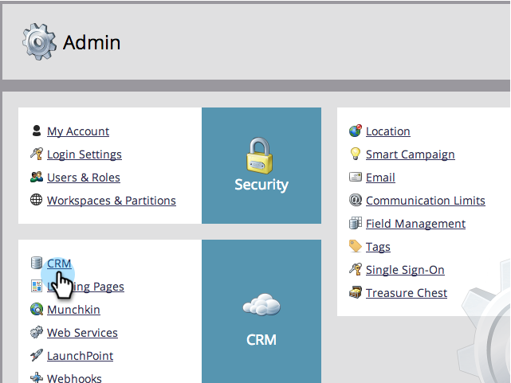
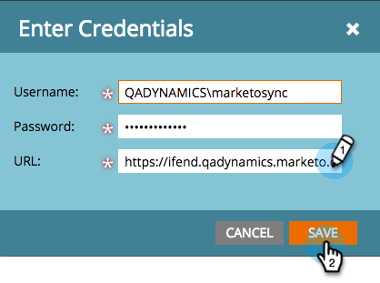

# Étape 3 sur 3 : Connexion de Microsoft Dynamics à Marketo (2011 On-Premise) {#step-of-connect-microsoft-dynamics-with-marketo-on-premises}

D&#39;accord ! Nous avons installé la solution et configuré l’utilisateur de synchronisation. Ensuite, nous devons connecter Marketo et Dynamics.

>[!PREREQUISITES]
>
>* [Étape 1 sur 3 : installation de la solution Marketo (2011 On-Premise)](/help/marketo/product-docs/crm-sync/microsoft-dynamics-sync/sync-setup/connecting-to-legacy-versions/step-1-of-3-install-2011.md){target="_blank"}
>* [Étape 2 de 3 : configurer l&#39;utilisateur de synchronisation Marketo dans Dynamics (2011 On-Premise)](/help/marketo/product-docs/crm-sync/microsoft-dynamics-sync/sync-setup/connecting-to-legacy-versions/step-2-of-3-set-up-2011.md){target="_blank"}

>[!NOTE]
>
>**Autorisations d’administrateur requises**

## Saisir les informations sur l&#39;utilisateur de synchronisation Dynamics {#enter-dynamics-sync-user-information}

1. Connectez-vous à Marketo et cliquez sur **[!UICONTROL Admin]**.

   

1. Cliquez sur **[!UICONTROL CRM]**.

   

1. Cliquez sur **[!DNL Microsoft]**.

   

1. Cliquez sur **[!UICONTROL Modifier]** dans **[!UICONTROL Saisir les informations d’identification]**.

   

   >[!CAUTION]
   >
   >Assurez-vous que vos informations d’identification sont correctes, car nous ne pouvons pas annuler les modifications de schéma suivantes après l’envoi. Si des informations d’identification incorrectes sont enregistrées, vous devrez obtenir un nouvel abonnement Marketo.

1. Saisissez les **[!UICONTROL Nom d’utilisateur]**, **[!UICONTROL Mot de passe]** et CRM **[!UICONTROL URL]**, puis cliquez sur **[!UICONTROL Enregistrer]**.

   

   >[!NOTE]
   >
   >* Le nom d’utilisateur dans Marketo doit correspondre au nom d’utilisateur pour l’utilisateur de synchronisation dans CRM. Le format peut être `user@domain.com` ou DOMAINE\utilisateur.
   >* Si vous ne connaissez pas l’URL, [apprenez à la trouver ici](/help/marketo/product-docs/crm-sync/microsoft-dynamics-sync/sync-setup/view-the-organization-service-url.md){target="_blank"}.

## Sélectionner les champs à synchroniser {#select-fields-to-sync}

Nous devons maintenant sélectionner les champs sur lesquels effectuer la synchronisation.

1. Cliquez sur **[!UICONTROL Modifier]** dans **[!UICONTROL Sélectionner les champs à synchroniser]**.

   

1. Certains champs présélectionnés seront synchronisés. Ajoutez d’autres éléments si vous le souhaitez, puis cliquez sur **[!UICONTROL Enregistrer]**.

   

   >[!NOTE]
   >
   >Marketo stocke une référence aux champs à synchroniser. Si vous supprimez un champ dans Dynamics, nous vous recommandons de le faire avec la [synchronisation désactivée](/help/marketo/product-docs/crm-sync/salesforce-sync/enable-disable-the-salesforce-sync.md){target="_blank"}. Ensuite, actualisez le schéma dans Marketo en modifiant et en enregistrant le [ Sélectionner les champs à synchroniser ](/help/marketo/product-docs/crm-sync/microsoft-dynamics-sync/microsoft-dynamics-sync-details/microsoft-dynamics-sync-field-sync/editing-fields-to-sync-before-deleting-them-in-dynamics.md){target="_blank"}.

## Synchroniser les champs pour un filtre personnalisé {#sync-fields-for-a-custom-filter}

Si vous avez créé un filtre personnalisé, veillez à y accéder et à sélectionner les nouveaux champs à synchroniser avec Marketo.

1. Accédez à Admin et sélectionnez **[!UICONTROL Microsoft Dynamics]**.

   

1. Cliquez sur **[!UICONTROL Modifier]** dans Détails de synchronisation des champs.

   

1. Faites défiler jusqu’au champ et cochez-le. Le nom réel doit être new_synctomkto mais le Nom d&#39;affichage peut être n&#39;importe quoi. Cliquez sur **[!UICONTROL Enregistrer]**.

   

## Activer la synchronisation {#enable-sync}

1. Cliquez sur **[!UICONTROL Modifier]** dans **[!UICONTROL Activer la synchronisation]**.

   

   >[!CAUTION]
   >
   >Marketo ne déduplique pas automatiquement les données par rapport à une synchronisation Microsoft Dynamics ou lorsque vous saisissez manuellement des personnes ou des prospects.

1. Lisez tout ce qui se trouve dans le pop-up, saisissez votre adresse e-mail, puis cliquez sur **[!UICONTROL Démarrer la synchronisation]**.

   

1. Selon le nombre d’enregistrements, la synchronisation initiale peut prendre entre quelques heures et quelques jours. Vous recevrez une notification par e-mail une fois l’opération terminée.

   
