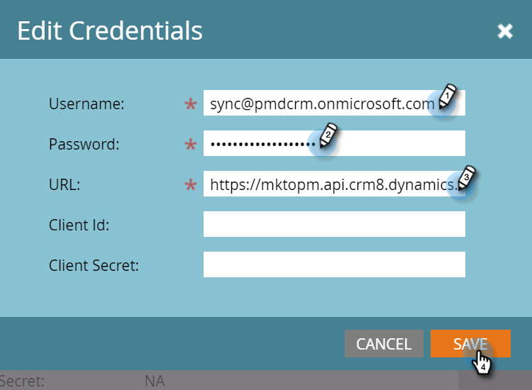

# Étape 3 sur 3 : Connexion à Marketo [!DNL Dynamics] (On-Prem 2015) {#step-of-connect-marketo-dynamics-on-premises-2015}

>[!PREREQUISITES]
>
>* [Installation de Marketo for [!DNL Microsoft Dynamics] 2015 On-Premise Étape 1 sur 3](/help/marketo/product-docs/crm-sync/microsoft-dynamics-sync/sync-setup/connecting-to-legacy-versions/step-1-of-3-install-2015.md)
>* [Installation de Marketo for [!DNL Microsoft Dynamics] 2015 On-Premise Étape 2 sur 3](/help/marketo/product-docs/crm-sync/microsoft-dynamics-sync/sync-setup/connecting-to-legacy-versions/step-2-of-3-set-up-2015.md)

>[!NOTE]
>
>**Autorisations d’administrateur requises**

## Saisir les informations sur l’utilisateur de la synchronisation [!DNL Dynamics] {#enter-dynamics-sync-user-information}

1. Connectez-vous à Marketo et cliquez sur **[!UICONTROL Admin]**.

   

1. Cliquez sur **[!UICONTROL CRM]**.

   

1. Sélectionnez **[!UICONTROL Microsoft]**.

   

1. Cliquez sur **[!UICONTROL Modifier]** à l’étape **[!UICONTROL 1 : Saisie des informations d’identification]**.

   

   >[!CAUTION]
   >
   >Assurez-vous que vos informations d’identification sont correctes, car nous ne pouvons pas annuler les modifications de schéma suivantes après l’envoi. Si des informations d’identification incorrectes sont enregistrées, vous devrez obtenir un nouvel abonnement Marketo.

1. Saisissez le **[!UICONTROL Nom d’utilisateur]**, **[!UICONTROL Mot de passe]** un [!DNL Microsoft Dynamics] **URL** et un **[!UICONTROL Identifiant client]/[!UICONTROL Secret client]**. Cliquez sur **[!UICONTROL Enregistrer]** lorsque vous avez terminé.

   

   >[!NOTE]
   >
   >* Si votre Marketo a été configuré avant octobre 2020, les champs ID client et Secret sont facultatifs. Sinon, elles sont obligatoires. L’obtention de ces informations dépend de la version de MSD que vous utilisez.
   >* Le nom d’utilisateur dans Marketo doit correspondre au nom d’utilisateur pour l’utilisateur de synchronisation dans CRM. Le format peut être `user@domain.com` ou DOMAINE\utilisateur.
   >* Si vous ne connaissez pas l’URL, [apprenez à la trouver ici](/help/marketo/product-docs/crm-sync/microsoft-dynamics-sync/sync-setup/view-the-organization-service-url.md){target="_blank"}.

   >[!TIP]
   >
   >Vous ne connaissez pas l&#39;URL ? Nous vous montrerons comment trouver votre [URL du service d’organisation Dynamics](/help/marketo/product-docs/crm-sync/microsoft-dynamics-sync/sync-setup/view-the-organization-service-url.md){target="_blank"} ici.

## Sélectionner les champs à synchroniser {#select-fields-to-sync}

1. Cliquez sur **[!UICONTROL Modifier]** à l’étape **[!UICONTROL 2 : sélection des champs à synchroniser]**.

   

1. Sélectionnez les champs que vous souhaitez synchroniser avec Marketo afin qu’ils soient présélectionnés. Cliquez sur **[!UICONTROL Enregistrer]**

   

>[!NOTE]
>
>Marketo stocke une référence aux champs à synchroniser. Si vous supprimez un champ dans [!DNL Dynamics], nous vous recommandons de le faire avec la [synchronisation désactivée](/help/marketo/product-docs/crm-sync/salesforce-sync/enable-disable-the-salesforce-sync.md). Ensuite, actualisez le schéma dans Marketo en modifiant et en enregistrant le [[!UICONTROL &#x200B; Sélectionner les champs à synchroniser &#x200B;]](/help/marketo/product-docs/crm-sync/microsoft-dynamics-sync/microsoft-dynamics-sync-details/microsoft-dynamics-sync-field-sync/editing-fields-to-sync-before-deleting-them-in-dynamics.md).

## Synchroniser les champs pour un filtre personnalisé {#sync-fields-for-a-custom-filter}

Si vous avez créé un filtre personnalisé, veillez à y accéder et à sélectionner les nouveaux champs à synchroniser avec Marketo.

1. Accédez à [!UICONTROL Admin] et sélectionnez **[!UICONTROL Microsoft Dynamics]**.

   

1. Cliquez sur **[!UICONTROL Modifier]** sur [!UICONTROL Détails de la synchronisation des champs].

   

1. Faites défiler jusqu’au champ et cochez-le. Le nom réel doit être new_synctomkto mais le Nom d&#39;affichage peut être n&#39;importe quoi. Cliquez sur **[!UICONTROL Enregistrer]**

   

## Activer la synchronisation {#enable-sync}

1. Cliquez sur **[!UICONTROL Modifier]** à l’**[!UICONTROL Étape 3 : activer la synchronisation]**.

   

   >[!CAUTION]
   >
   >Marketo ne déduplique pas automatiquement les données par rapport à une synchronisation [!DNL Microsoft Dynamics] ou lorsque vous saisissez manuellement des personnes.

1. Lisez tout ce qui se trouve dans le pop-up, saisissez votre adresse e-mail, puis cliquez sur **[!UICONTROL Démarrer la synchronisation]**.

   

1. Selon le nombre d’enregistrements, la synchronisation initiale peut prendre entre quelques heures et quelques jours. Vous recevrez une notification par e-mail une fois l’opération terminée.

   
