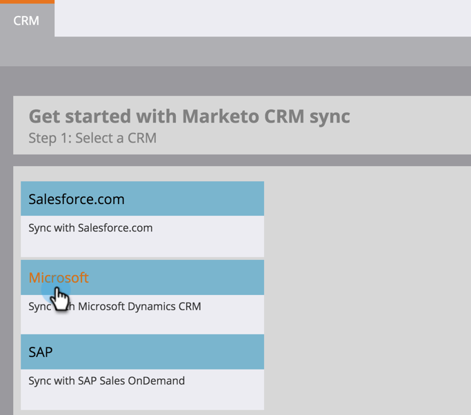
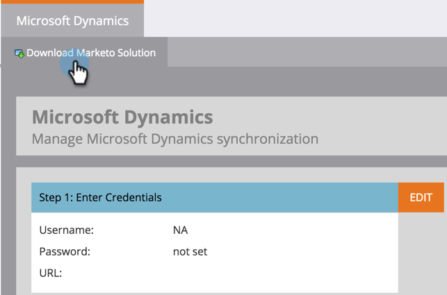

# Téléchargement de la solution de gestion des leads Marketo {#download-the-marketo-lead-management-solution}

>[!NOTE]
>
>**Autorisations d’administrateur requises**

Vous devrez télécharger et installer une solution de Marketo Engage dans votre compte Microsoft Dynamics pour démarrer la synchronisation.

>[!CAUTION]
>
>Vous devez impérativement télécharger la dernière solution Marketo _avant_ d’effectuer une mise à niveau.

>[!NOTE]
>
>Marketo ne prend en charge que les certificats SSL compatibles avec Java 7 pour le moment.

1. Accédez à la zone **[!UICONTROL Admin]**.

   

1. Cliquez sur **[!UICONTROL CRM]**.

   

1. Sélectionnez **[!DNL Microsoft]**.

   

1. Sélectionnez **[!UICONTROL Télécharger la solution Marketo]**.

   

1. Sélectionnez la solution appropriée pour votre version de Microsoft Dynamics.

   

Super ! Un fichier zip de la solution sera désormais téléchargé sur votre appareil.
