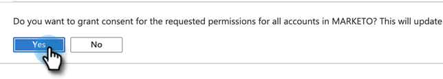

# Accorder le consentement pour l’enregistrement de l’ID client et de l’application {#grant-consent-for-client-id-and-app-registration}

Suivez les étapes ci-dessous pour savoir comment accorder le consentement/les autorisations nécessaires.

## Octroyer des autorisations d’utilisateur délégué pour l’utilisateur de synchronisation {#grant-delegated-user-permissions-for-the-sync-user}

1. Utilisez un programme de texte clair (Bloc-notes pour Windows, Édition de texte pour Mac) pour créer un URI (Uniform Resource Identifier) à autoriser en collant le texte ci-dessous et en remplaçant les valeurs `client_id`, `redirect_uri` et `state`.

   ```
   https://login.microsoftonline.com/common/oauth2/authorize?
   client_id='xxxxxx-xxxx-xxxx-xxxx-xxxxxxxx'
   &response_type='code'
   &redirect_uri='https://www.<ourdomain>.com'
   &response_mode='query'
   &state='SOME_UNIQUE_UID'
   client_id value should be the client_id generated in App Registration process
   redirect_uri value should be same as value entered at the time of App registration-> Redirect URIs
   state value can be any ID (e.g.,12345)
   ```

   <table>
    <colgroup>
     <col>
     <col>
    </colgroup>
    <tbody>
     <tr>
      <td><strong>valeur client_id</strong></td>
      <td>doit être le client_id généré dans le processus d’enregistrement de l’application.</td>
     </tr>
     <tr>
      <td><strong>valeur redirect_uri</strong></td>
      <td>doit être identique à la valeur saisie au moment de l’enregistrement de l’application &gt; URI de redirection</td>
     </tr>
     <tr>
      <td><strong>valeur d'état</strong></td>
      <td>peut être n’importe quel ID (par exemple, 12345).</td>
     </tr>
    </tbody>
   </table>

   L’URL finale doit se présenter comme suit : `https://login.microsoftonline.com/common/oauth2/authorize?client_id=xxxxxx-xxxx-xxxx-xxxx-xxxxxxxx&response_type=code&redirect_uri=https://www.marketo.com&response_mode=query&state=12345`

1. Ouvrez l’URI que vous avez créé dans n’importe quel navigateur.

   

1. Connectez-vous en tant qu’utilisateur de synchronisation pour lequel vous accordez des autorisations.

   

   >[!NOTE]
   >
   >Si vous êtes déjà connecté à Azure en tant qu’administrateur dans un autre onglet, vous devrez utiliser un autre navigateur ou un autre mode Incognito pour vous connecter en tant qu’utilisateur de synchronisation.

1. Cliquez sur **[!UICONTROL Accepter]**.

   

## Accorder le consentement pour tous les utilisateurs {#grant-consent-for-all-users}

En tant qu’administrateur, vous pouvez également consentir aux autorisations déléguées d’une application au nom de tous les utilisateurs de votre client. Le consentement administratif empêche l’affichage de la boîte de dialogue de consentement pour chaque utilisateur dans le client. Cela peut être effectué dans le portail Azure par les utilisateurs dotés du rôle d’administrateur. Découvrez les rôles d’administrateur qui peuvent [consentir aux autorisations déléguées ici](https://docs.microsoft.com/en-us/azure/active-directory/roles/permissions-reference).

1. Sur votre portail Azure, accédez à la page d’accueil de l’application.

1. Sous [!UICONTROL Gérer], cliquez sur **[!UICONTROL Autorisations API]**.

   

1. Cliquez sur le bouton **[!UICONTROL Accorder le consentement administrateur]** (pour le client).

   

1. Cliquez sur **[!UICONTROL Oui]** pour confirmer.

   
