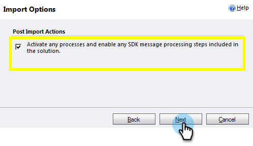

# Étape 1 sur 3 : Installer la solution Marketo (2011 sur site) {#step-of-install-the-marketo-solution-on-premises}

Avant de pouvoir synchroniser Microsoft Dynamics On-Premises et Marketo, vous devez d&#39;abord installer la solution Marketo dans Dynamics.

>[!NOTE]
>
>Une fois que vous avez synchronisé Marketo sur un service de gestion de la relation client, vous ne pouvez pas effectuer une nouvelle synchronisation sans remplacer l’instance.

>[!PREREQUISITES]
>
>[Déploiement Internet Facing](https://www.microsoft.com/en-us/download/confirmation.aspx?id=41701) (IFD) avec [Principale Directory Federation Services](https://msdn.microsoft.com/en-us/library/bb897402.aspx) 2.0, 2.1 ou 3.0 (ADFS) configuré. **Remarque** : Le document IFD se télécharge automatiquement lorsque vous cliquez sur le lien.
>
>[Téléchargez la ](/help/marketo/product-docs/crm-sync/microsoft-dynamics-sync/sync-setup/download-the-marketo-lead-management-solution.md) solution de gestion des pistes marketing avant de début.

>[!NOTE]
>
>**Autorisations d&#39;administrateur Dynamics requises.**
>
>Vous avez besoin de droits d’administrateur CRM pour effectuer cette synchronisation.

1. Connectez-vous à **Dynamics**, sélectionnez **Paramètres** dans le menu inférieur gauche.

   

1. Sélectionnez **Solutions** dans l&#39;arborescence.

   

1. Cliquez sur **Importer**.

   

1. Cliquez sur **Parcourir**. Sélectionnez la solution de gestion des pistes marketing que vous avez [téléchargée](/help/marketo/product-docs/crm-sync/microsoft-dynamics-sync/sync-setup/download-the-marketo-lead-management-solution.md). Cliquez sur **Suivant**.

   

1. Vue les informations de solution et cliquez sur **détails du package de la solution de Vue**.

   

1. Lorsque vous avez terminé de vérifier tous les détails, cliquez sur **Fermer**.

   

1. De retour sur la page Informations sur la solution, cliquez sur **Suivant**.

   

1. Assurez-vous que la case à cocher de l’option de message SDK est activée. Cliquez sur **Suivant**.

   

   >[!TIP]
   >
   >Vous devez activer les fenêtres contextuelles de votre navigateur pour terminer le processus d’installation.

1. Attendez maintenant la fin de l’importation. Levez-vous et faites des étirements.

   

1. Cliquez sur **Fermer**.

   >[!NOTE]
   >
   >Un message indiquant &quot;Gestion des pistes marketing terminée avec un avertissement&quot; peut s’afficher. On s&#39;y attend pleinement.

   

1. La gestion des pistes marketing s’affiche désormais sur la page **Toutes les solutions**.

   

1. Sélectionnez Gestion des pistes marketing et cliquez sur **Publier toutes les personnalisations.**

   

N&#39;était-ce pas un mauvais droit ? Allez, je continuerai à vous faire traverser le reste.

>[!CAUTION]
>
>La désactivation de l’un des processus de messagerie du SDK de Marketo entraîne une panne de l’installation !

>[!MORELIKETHIS]
>
>[Étape 2 sur 3 : Configurer un utilisateur de synchronisation marketing dans Dynamics (local 2011)](/help/marketo/product-docs/crm-sync/microsoft-dynamics-sync/sync-setup/microsoft-dynamics-2011-on-premises/step-2-of-3-set-up.md)
